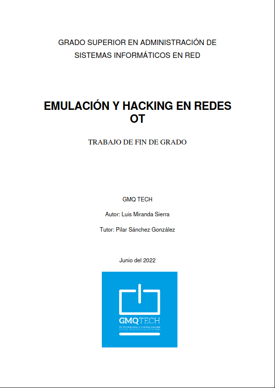

El día 21-06-2022 tuvo lugar la presentación de mi TFG sobre la emulación y hacking en redes ot, donde explico como desplegar y emular en la red un PLC y un SCADA opensource usando
los softwares OpenPLC y SCADABR. El TFG culmina con una demostración de ataque a OpenPLC en un entorno controlado <a href="../../assets/archivos/TFG_Final.pdf" target="_blank">TFG</a>.
 
 

 
