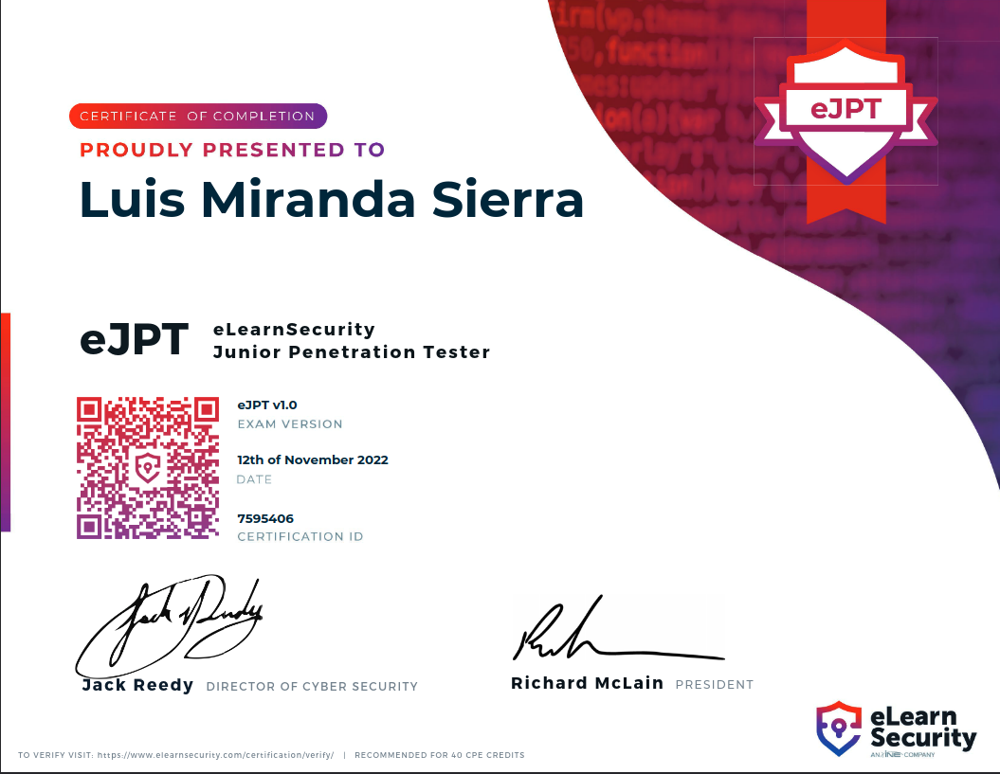
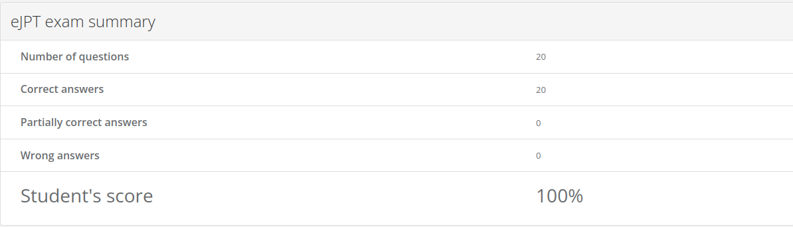

## INTRODUCCION

El pasado 12 de noviembre me certifiqué como eJPT, me gustaría compartir mi experiencia por si puede ayudar a la comunidad.

## INDICE

- [Introducción](#introduccion)

- [Mis conocimientos previos](#mis-conocimientos-previos)

- [Material INE](#material-de-estudio-del-ine)
  
  - [Penetration Testing Prerequisites](#penetration-testing-prerequisites)
  
  - [Penetration Testing  Basics](#penetration-testing-basics)
  
  - [Black Boxes ](#black-boxes)

- [Consejos y Tips](#consejos-y-tips)

- [Examen](#examen)
  
  - [Formato](#formato)
  
  - [Tiempo](#tiempo)

- [Material de apoyo](#material-de-apoyo)

- [Conclusion](#conclusion)

- [Contacto](#contacto)

## MIS CONOCIMIENTOS PREVIOS

Mis conocimientos previos al examen en el campo de la ciberseguridad se centran sobre todo en los CTF  de [HTB](https://app.hackthebox.com/profile/1104062){:target="_blank"}, donde he completado unas 33 máquinas en su mayoría de categoría fácil. También estoy titulado en ASIR por lo que tengo unos conocimientos previos de redes útiles para la certificación. El material ofrecido por el INE está pensado para personas con 0 experiencia en el campo del pentesting por lo que no necesitáis unos conocimientos previos. 

## MATERIAL DE ESTUDIO DEL INE

El curso gratuito dell INE Penetration Testing Student que cubre por completo el contenido del examen, en mi caso realice los módulos **Penetration Testing Prerequisites** y **Penetration Testing Basics** que son los necesarios para completar la certificación sin problema alguno. El segundo módulo **Penetration Testing: Preliminary Skills & Programming** está enfocado en la programación, el conocimiento siempre es útil por lo que es recomendable echarle un ojo, pero en mi caso por falta de tiempo no lo realicé, ya que tengo unas bases de programación suficientes. 

### Penetration Testing Prerequisites:

Este módulo tiene una duración aproximada de 11 horas y 26 minutos, cubriendo los aspectos necesarios sobre redes, análisis de archivos .pcap, conceptos básicos de aplicaciones web entre otros. La verdad que lo miré por encima, ya que ASIR te brinda unos conocimientos de redes mas que suficientes. Recomiendo realizar todos los laboratorios, pero sobre todo los dos siguientes los considero los más importantes a la hora de enfrentarte al examen:

- Find the Secret Server

- Data Exfiltration 

### Penetration Testing Basics

En este módulo te explican las herramientas y vulnerabilidades más conocidas para realizar un pentesting, respecto a las herramientas no es necesario utilizar exactamente las señaladas por el curso, te recomiendo utilizar las herramientas con las que más familiarizado estés. 

### Black Boxes

Estas tres máquinas dadas por el INE son más complicadas que el examen, por lo que recomiendo intentar realizarlas sin ayuda, pero si necesitáis algún empujón os dejo los write ups que realicé en su momento, es normal quedarse atascado en algún punto:

- [BLACK-BOX PENETRATION TEST 1](https://void4m0n.gitbook.io/certs/ejpt/write-up-black-box-1){:target="_blank"}

- [BLACK-BOX PENETRATION TEST 2](https://void4m0n.gitbook.io/certs/ejpt/write-up-black-box-2){:target="_blank"}

## CONSEJOS Y TIPS

Para el examen no hice uso en ningún momento de metasploit, esta es la metodología que utilizo a la hora de realizar CTFs en HTB u otras plataformas, cada uno puede hacer el examen como quiera, eLearnsecurity no te prohíbe usar ninguna herramienta y no tienes a nadie que te vigile por lo que puedes consultar el material del curso en cualquier momento. Os dejo algunos consejos que os pueden venir bien:

- Sigue una metodología de pentesting propia o de un tercero. Una buena metodología ahorra trabajo, haciéndote más eficaz.

- Toma notas de todo, siempre es mejor que sobre a que falte. En mi caso utilizo CherryTree para guardar los resultados de los escaneos de red, ataques de fuerza bruta, payloads exitosos, etc...

- Representar la información obtenida te ayuda a visualizar posibles vectores de ataque que hayas podido pasar por alto, por ejemplo: puedes realizar un esquema de cómo está distribuida la red con sus respectivos equipos junto a su sistema operativo, routers, etc...

- En mi caso intenté realizar todo el examen de forma manual pero si ves que tus resultados no concuerdan en base a una pregunta puedes utilizar herramientas como ZAP. Estas en concreto realiza escaneos automatizados a aplicaciones web permitiéndote comprobar que no se te escape nada. 

## EXAMEN

### FORMATO

El examen consta de 20 preguntas tipo test donde tienes que responder 15 correctamente para aprobar, si has comprometido las máquinas de forma exitosa o has recabado la suficiente información no deberías tener ningún problema a la hora de contestar. 

### TIEMPO

El tiempo dado son 3 días, tienes de sobra. En mi caso empecé un viernes por la noche sobre las 22:00, a las 3:00 am ya podía enviar el examen sabiendo que aprobaba, pero como no tenía prisa decidí ponerme el sábado por la mañana con un café a repasar todas las preguntas. Sobre las 12:00 am envíe el examen y el resultado es instantáneo, mi nota fue un ¡20/20!.

## MATERIAL DE APOYO

Si dispones del vip de HTB te recomiendo realizar las siguientes máquinas, si no lo tienes o necesitas ayuda para rootearlas también adjunto los write ups que realicé en su momento y una pequeña cheatsheet con comandos para la eJPT:

- [BLUE](https://void4m0n.github.io/Blue-Hack-The-Box/){:target="_blank"}

- [LEGACY](https://void4m0n.github.io/Legacy-Hack-The-Box/){:target="_blank"}

- [eJPT CHEATSHEET](https://void4m0n.gitbook.io/certs/ejpt/ejpt-notes){:target="_blank"}

## CONCLUSION

En mi opinión para afrontar esta certificación hay que enfocarse en divertirse, tomarse el examen como un reto. Recomiendo la eJPT para todas aquellas personas que estén empezando en el pentesting. Esta certificación te  ayuda a dar ese primer paso en un campo tan impresionante. Mi siguiente objetivo será la eCPPTv2.

## CONTACTO

Para cualquier duda me podéis contactar a través de [Twitter](https://twitter.com/Void4m0n){:target="_blank"} sin compromiso alguno, recalco que no voy a dar ninguna respuesta del propio examen, esforzándose un poco lo sacáis por vuestra cuenta sin ningún problema.
