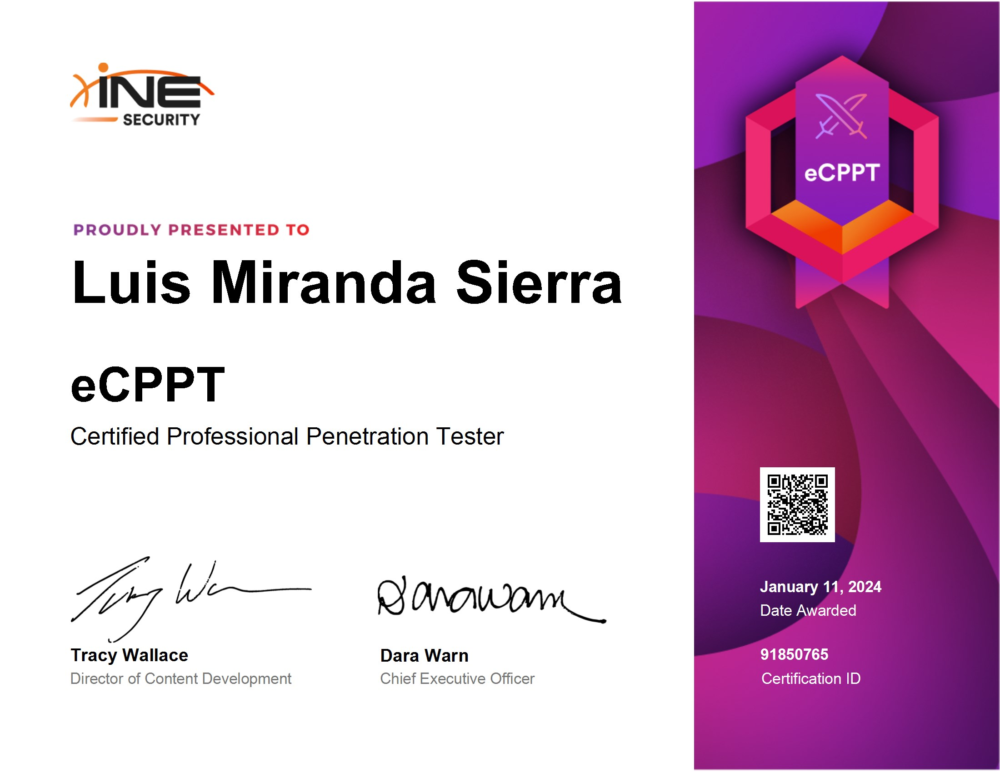

## Introducción
El pasado 6 de noviembre decidí examinarme de la certificación eCPPTv2, el objetivo de este post es compartir mi experiencia personal tanto en la preparación como en el examen.

## Indice

- [Introducción](#introducción)
- [¿Por qué la eCPPTv2?](#porque)
- [Conocimientos Previos](#conocimientos-previos)
- [Learning Path Penetration Testing Professional](#ine)
    - [Puntos Fuertes](#fuertes)
    - [Puntos Débiles](#debiles)
- [Recursos Externos](#recursos)
    - [Pivoting](#pivoting)
    - [Buffer Overflow](#buffer-overflow)
    - [Laborario Final](#laboratorio-final)
- [Examen](#examen)
    - [Herramientas Utilizadas](#herramientas-utilizadas)
    - [Día 1 pwn, pwn y más pwn](#dia1)
    - [Día 2 enumeración, enumeración y más enumeración](#dia2)
    - [Dias 4-8](#reporting)
- [Conclusión](#conclusión)
- [Contacto](#contacto)

<h2 style="text-align:center" id="porque">¿Por qué la eCPPTv2?</h2>
La verdad que elegí esta certificación porque estaba buscando un paso intermedio en dificultad respecto a la OSCP y a mi parecer puede que la eCPPTv2 se quede corta en este aspecto, punto que comentaré más adelante.

## Conocimientos Previos
La verdad que antes de prepararme la certificación ya contaba con bastante experiencia en CTFs, sobre todo dentro de la plataforma de HTB. Además tengo la suerte de que a día de hoy me dedico de forma profesional al pentesting WEB, que aunque esta certificación no se enfoca excesivamente en hacking web se puede decir que la parte de reporting la tengo más que entrenada.

Los conocimientos más importantes para aprobar el examen son los siguientes:

- **Pivoting a nivel de red**.
- **Buffer over Flow (Básico, sin protecciones)**.
- Escalada de privilegios.
- Hacking Web (OWASP 10).

Si controlas a nivel básico estos temas no vas a tener ningún problema en aprobar, pero sobre todo es muy importante tener claro **Pivoting de redes** .
<h2 style="text-align:center" id="ine">Learning Path Penetration Testing Professional (No Recomendado)</h2>
Para prepararme la certificación he seguido el learning Path correspondiente al eCPPT ***"Penetration Testing Professional"*** de INE y a mi parecer tiene tanto puntos fuertes como débiles, pero si tuviese que decantarme por volver a certificarme lo haría por mi cuenta, dejando a un lado la preparación ofrecida por INE, ya que, en mi opinión, los puntos fuertes no logran compensar los puntos débiles de la formación.
<h3 style="font-size:1.20em" id="fuertes">Puntos Fuertes</h3>
___
Como puntos fuertes se podría destacar que dentro del material se incluyen diferentes técnicas como ataques MiTM, UAC bypasses, DDL hijacking, etc... Todos con sus respectivos laboratorios para practicar. Al final es conocimiento "extra" que se agradece, si solo se limitase a lo que vas a tocar en el examen se quedaría excesivamente corto.

<h3 style="font-size:1.20em" id="debiles">Puntos Débilies</h3>
___
En mi opinión el material peca mucho del uso de slides, me parece un buen método cuando lo complementas con los laboratorios, pero si que es verdad que se puede llegar a hacer algo tedioso tanto PowerPoint. 

Los laboratorios son vía instancias WEB sin conexión a internet, forzándote a realizar los laboratorios con la herramientas dadas, y si como en mi caso te planteas el examen sin el uso de metasploit se puede volver un verdadero martirio. Además al cabo de una  hora el lab se cierra y te toca volver a empezar de cero hasta recuperar el punto en el que lo dejaste.

Y por útlimo hay que tener en cuenta el coste de la suscripción premium de INE para tener acceso al Learning Path, que en mi opinion si se valora la relación calidad precio no me parece demasiado buena. Se puede encontrar contenido de mejor calidad de forma gratuita en internet, os dejo todos los recursos necesarios para aprobar el examen en el siguiente apartado.

<h2 style="font-size:1.20em" id="recursos">Recursos Externos (Recomendado)</h2>
Si decides afrontar la certificación por tu cuentas te recomiendo los siguientes recursos para aprobar sin ningún problema.

### Pivoting
Si no habéis tocado nunca pivoting este laboratorio es clave:  [Laboratior básico de pivoting](https://youtu.be/L1jSoCcvRY4){:target="_blank"} (***S4vitar***) , explica el concepto de manera simple y práctica.

### Buffer Overflow
El BoF del examen es totalmente básico, sin protecciones. En el momento que entiendes el concepto se convierte en un a, b, c. 

Para prepararlo bien os dejo los siguientes recursos:

- [Buffer Overflow Made Easy](https://youtu.be/ncBblM920jw){:target="_blank"} (***The Cyber Mentor***)
Video perfecto para entender el Buffer Overflow desde 0, aprendiendo la metodología. Una vez entendidos los conceptos vais a poder explotar cualquier BoF simple sin ningún problema.

- [Write Up de un BoF Paso a Paso](https://jaymonsecurity.com/exploiting-buffer-overflow-bof/){:target="_blank"} (***Juan M.R Jaymon Security***)
En este Write Up tenéis paso a paso explicado un BoF básico por si necesitáis echarle un ojo más en profundidad.

- [VulnServer](https://github.com/stephenbradshaw/vulnserver){:target="_blank"} (***stephenbradshaw***)
Es un servidor vulnerable para Windows que podéis utilizar para practicar. Os recomiendo que tras interiorizar la metodología lo intentéis explotar por vuestra cuenta

- [Mona CheatSheet](https://x3tb3t.github.io/2018/03/29/mona/){:target="_blank"} (***x3tb3t***) Cheatsheet del modulo mona para Immunity debugger.

### Laboratorio final
En mi opinión este es el recurso más importante, os permite montaros un laboratorio para hacer una simulación del examen: [Laboratio simulando el examen](https://youtu.be/Q7UeWILja-g?si=CV6rRy_bBXOffkVC){:target="_blank"} (***S4vitar***). En términos de dificultad es más complejo que el examen real, así que si lo podéis comprometer no tendréis ningún problema durante la certificación.

## Examen
INE te da 7 días de acceso al laboratorio para la parte práctica, tras este periodo se suman otros 7 días para la fase de reporting, dando como resultado un total de 14 días (más que suficiente). La parte práctica me llevó dos días hasta comprometer el Servidor DMZ, y para la fase de reporting estuve un total de 4 días, como tenía tiempo de sobra me lo tomé con calma.

### Herramientas utilizadas
Como ya he comentado antes realicé el examen sin utilizar Metasploit con el objetivo de prepararme la OSCP donde no se permite su uso. Como el laboratorio está bastante desactualizado os dejo una tabla con las herramientas utilizadas para pivoting y sus fuentes de descarga, así os ahorro el prueba y error 😉:

<table>
  <thead>
    <tr style="background-color:#636363">
      <th>Herramienta</th>
      <th>sha256-sum</th>
      <th>Fuente</th>
    </tr>
  </thead>
  <tbody>
    <tr>
      <td>chisel_1.5.0_linux_386</td>
      <td>556d74402c8b40dcededa3cd27405f78f4b359082a2df37a5fff81b57dede6ba</td>
      <td>https://github.com/jpillora/chisel/releases/download/v1.5.0/chisel_1.5.0_linux_386.gz</td>
    </tr>
    <tr>
      <td>chisel_1.5.0_windows_amd64</td>
      <td>3676c2365ffc117bd5cdc21503ecfd2c926201e8a7d9bc97610872590ba3ec1d</td>
      <td>https://github.com/jpillora/chisel/releases/download/v1.5.0/chisel_1.5.0_windows_amd64.gz</td>
    </tr>
    <tr>
      <td>socat-2.0.0-b8 (i386)</td>
      <td>ce8d48e07e3d0b94dbb5456ed33fd33d1b4a05ce4de1e988e477f776e89143c7</td>
      <td>https://github.com/static-linux/static-binaries-i386/raw/master/socat-2.0.0-b8.tar.gz</td>
    </tr>
  </tbody>
</table>

<h3 style="font-size:1.20em" id="dia1">Día 1 pwn, pwn y más pwn</h3>
Empecé el día uno con buen ritmo, tras las dos primeras horas ya tenía comprometida la primera máquina con root level, un consejo que os puedo dar es que realicéis el escaneo de NMAP varias veces, no vaya a ser que comprometáis la máquina y al echar un ojo a los puertos abiertos veías que nmap se ha comido algún puerto...

Tras comprometer la primera máquina las otras vinieron de seguido, pwneando las máquinas 2 y 3 bastante *straightforward*. En este momento me tocaba enfrentarme al BoF, por lo que al traerme el binario a mi máquina de debugging (Windows XP) no se podía ejecutar, ya que necesitaba un Windows 7. Terminé el día montándome el entorno de debugging sobre un Windows 7 y dejé el BoF para el día siguiente.

<h3 style="font-size:1.20em" id="dia2">Día 2 enumeración, enumeración y más enumeración</h3>
Empecé el día explotando el BoF el cual no tiene ninguna complicación, siguiendo le metodología es A, B, C. Tras comprometer la cuarta máquina tan solo quedaba el servidor DMZ, en este momento estuve prácticamente 4 horas enumerando. Al final es mejor dejar a un lado la consola y pasar a algo más gráfico...

Tras obtener lo necesario para comprometer el servidor DMZ, la explotación es directa. Por lo que antes de acabar el Día 2 ya tenía todas las máquinas comprometidas.
<h3 style="font-size:1.20em" id="reporting">Días 4-8</h3>
Como ya tenía todo comprometido me tomé el día 3 como descanso y empecé con el reporting que sabía que era lo que más tiempo me iba a llevar, así que aproveché para repasar bien todas las máquinas mientras iba realizando el informe. Para el reporte me basé en la template de [TCM](https://github.com/hmaverickadams/TCM-Security-Sample-Pentest-Report/blob/master/Demo%20Company%20-%20Security%20Assessment%20Findings%20Report.docx){:target="_blank"}, dividiendo cada host en las siguientes secciones: 

- Host 
	- Vulnerabilidades Remotas
	- Escalada de Privilegios
	- Persistencia
	- Vulnerabilidades/Malas configuraciones Locales 
	- Enumeración
	- Pivoting 

**Todos las Vulnerabilidades con su correspondiente: Descripción, Impacto, CVSS, ID, Sistema afectado, Referencias, PoC y Remediación**.

El reporte final constó de 123 páginas, en alguna que otra reseña comentan que el reportes les ocupo alrededor de las 40-50 páginas y aprobaron sin problema, por lo que entiendo que tampoco se tiene que realizar un reporte tan extenso y detallado. La corrección del reporto tardó práctimante un mes.
## Conclusión
En mi opinión es una certificación que vale la pena por su precio, con las típicas ofertas de blackfriday o en algunos momentos del año la puedes llegar a adquirir por 200€, que a mi parecer a modo de preparación para la OSCP vale la pena.

## Contacto
Para cualquier duda me podéis contactar a través de [Twitter](https://twitter.com/Void4m0n){:target="_blank"} sin compromiso alguno, recalco que no voy a dar ninguna respuesta acerca del propio examen, pero si teneis algún problema/duda acerca de la preparación no dudeis en preguntarme.
