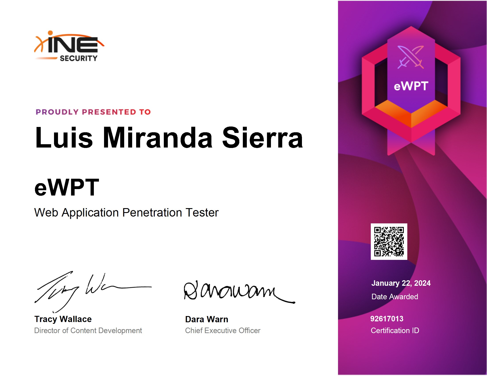
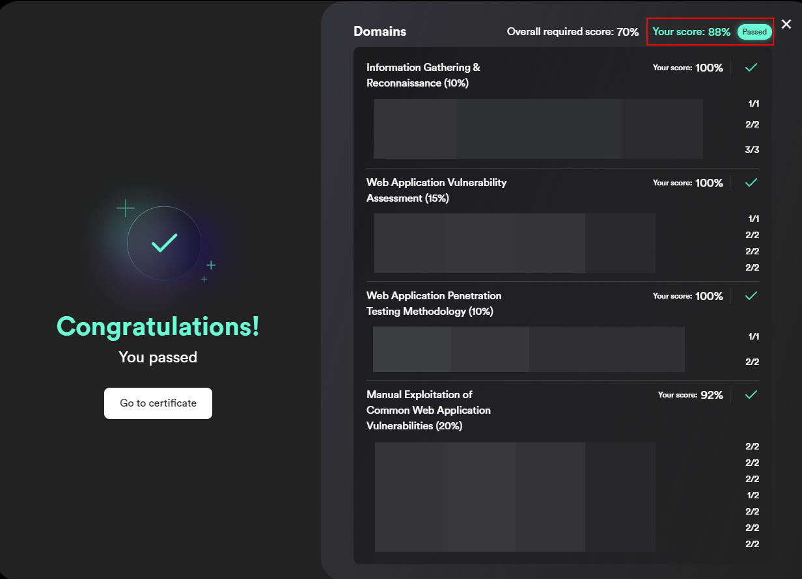

## Introducción
El pasado 21 de enero decidí examinarme de la certificación eWPTv2. El objetivo de este post es compartir mi experiencia personal tanto en la preparación como en el examen.

## Indice

- [Introducción](#introducción)
- [¿Por qué la eWPTv2?](#porque)
- [Conocimientos Previos](#conocimientos-previos)
- [Preparación](#preparación)
- [Examen](#examen)
    - [Entorno](#entorno)
    - [Herramientas Utilizadas](#tools)
    - [Dificultades](#dificultades)
    - [Consejos](#consejos)
- [Conclusión](#conclusión)
- [Contacto](#contacto)

<h2 style="text-align:center" id="porque">¿Por qué la eWPTv2?</h2>
Esta certificación la tenía en mente desde hace tiempo pero al final por falta de tiempo no me decidía a examinarme. El motivo principal por el cual me he decidido certificarme de la eWPTv2 es la actualización que recibió en el mes de octubre del 2023, donde cambiaron el formato de examen y se actualizaron los contenidos, puntos que comentaré más adelante.
## Conocimientos Previos
La verdad que a día de hoy siento que el hacking WEB lo tengo bastante controlado, al final tengo la suerte de dedicarme a ello a nivel profesional por lo que me enfrento a este tipo de retos de forma constante. Además siempre que tengo algo de tiempo y no estoy con otra certificación me dedico a realizar algún que otro CTF en HTB, que la verdad te ayuda a explotar escenarios más "rocambolesca" que son difíciles de encontrar en entornos reales. Juntando tanto CTF como entornos reales te da la combinación perfecta para prepararte este examen sin realizar el curso ofrecido por INE.

Los conocimientos más importantes para aprobar el examen son los siguientes:

- OWASP 10: Básicamente saber identificar y explotar las típicas vulnerabilidades (SQLi, XSS, FILE UPLOAD, LFI, RFI, etc...)
- Reconocimiento tanto a nivel de servidor como de aplicación WEB.
- CMS Hacking:  Wordpress, Joomla, etc...

## Preparación	

Para prepararte la certificación INE tiene el [Web Application Penetration Testing Professional](https://my.ine.com/CyberSecurity/learning-paths/8c322180-1499-40c7-af8f-a877554fca3d/web-application-penetration-testing-professional-ewptv2){:target="_blank"}, en mi caso yo decidí examinarme por mi cuenta con los conocimientos que ya tenía adquiridos, por lo que no puedo dar mi opinión sobre la formación. Durante el examen no sentí que me hubiese hecho falta realizar la formación ofrecida por INE, si controlas los  temas mencionados anteriormente podrías presentarte al examen sin necesidad de tomar el curso.

Si no tienes del todo claro el funcionamiento de un pentesting WEB os recomiendo que le echéis un ojo a la [Web Security Testing Guide](https://owasp.org/www-project-web-security-testing-guide/v42/4-Web_Application_Security_Testing/){:target="_blank"} de OWASP, donde básicamente explica todas las partes de una auditoría web con los test/pruebas necesarios durante el trascurso del pentesting.
## Examen
INE ha cambiado el formato del examen, la anterior eWPT constaba de 7 día de laboratorio y 7 de reporta, sin embargo, ahora la certificación son 10 horas de laboratorio y durante ese tiempo debes contestar 50 preguntas. Os recomiendo que antes de empezar con el reconocimiento leáis todas las preguntas para haceros una idea de que os vais a encontrar en el examen. Existen dos tipos de preguntas:

- Múltiple opción: Las mayorías de preguntas son de este tipo, básicamente te dan cuatro opciones y tienes que escoger la correcta. por lo que si hay alguna que no tienes del todo claro intenta limitar las opciones para quedarte entre dos respuestas y tener un 50% de probabilidad de acierto.  
- Respuesta corta: Estas preguntas te obligan a explotar la vulnerabilidad o hacer el reconocimiento correcto para conocer exactamente la respuesta.

Para aprobar necesitas el 70% de preguntas correctas, es decir 35/50. En mi caso tuve 44 preguntas respondidas correctamente (88%):

<h3 style="font-size:1.20em" id="entorno">Entorno</h3>
Para conectarte al laboratorio lo haces a través de una instancia WEB (Apache Guacamole) donde está montado un **Kali sin conexión a internet**, pero con todas las herramientas necesarias instaladas. No soy muy fan de este tipo de accesos, prefiero una VPN para conectarme con mi máquina habitual, pero si que es verdad que como la máquina atacante está conectada de forma local con las máquinas víctima cualquier escaneo que lances irá volando.

Respecto a la estabilidad del laboratorio no tuve prácticamente ningún problema que no fuese por mi culpa. En el caso de que encontréis alguna SQLi y utilicéis sqlmap asegurados de evitar las heavy queries, limitando el risk a 1 (El risk es 1 por defecto) o evitando la explotación time-based `--technique=BEUSQ`, porque esta técnica deja tonto el lab y te toca resetar. Esta acción borra todo el contenido existente en el Kali, pero el laboratorio sigue siendo el mismo y las flags que hayáis encontrado antes siguen siendo válidas a no ser que cambies de región.

<h3 style="font-size:1.20em" id="tools">Herramientas utilizadas</h3>
Para el examen podéis utilizar cualquiera de las tools instaladas en el Kali, pero os recomiendo las siguientes:
- Escaneo WEB: 
	- Nikto: Muy recomendada, yo la he usaba al final de la enumaración por si me había saltado algo, y la verdad que ha sacado alguna cosilla que había pasado por alto.
	- Nmap: Esencial para escanear los puertos/servicios expuestos en el servidor objetivo.
- Enumeración de directorios: 
	- Feroxbuster: Mi tool favorita para el escaneo de directorios.
	- Wfuzz: Otra herramienta que podéis usar para el escaneo de directoritos o ataques de fuerza bruta.
- Fuerza bruta:
	- Hydra: La fuerza bruta no tiene un papel muy fundamental en el examen, pero nunca está de más probar, nunca se sabe...
- SQLi:
	- Sqlmap: En este examen ya os digo yo que el tiempo no os va a sobrar, por lo que automatizar posibles SQLi os será de gran ayuda.
- CMS Hacking:
	- wpscan: Clave para auditorias de seguridad sobre WordPress, te automatiza gran parte de la pruebas y una de las más útiles es la fuerza bruta de detección de plugins vulnerables.
	- joomscan: Recomendada a la hora de escanear un site montado con Joomla.
- Password Cracking:
	- Hashcat: Perfecta para el cracking de passwords, en mi caso la tool del lab fallaba, pero os recomiendo tener instalado el hashcat en una VM o sobre el propio OS principal.
	- John The Ripper: Esta funciona flawless sobre el Kali, pero si que es verdad que es menos eficiente que Hashcat.

<h3 style="font-size:1.20em" id="dificultades">Dificultades</h3>
Para ser sincero me esperaba un examen más complicado a nivel técnico, pero si que es verdad que el factor tiempo hace que la certificación si que suponga  un reto. Las 10 horas en un primer momento pueden parecer mucho, pero el examen tiene bastante vulnerabilidades por explotar.  También es verdad que gasté gran parte del tiempo revisando si me había dejado alguna vulnerabilidad, ya que es posible que en el examen te pregunten cuantas vulnerabilidades del tipo *X* existen, por lo que si te has dejado alguna la has pifiado. 

Por lo demás las vulnerabilidades son fáciles de explotar, yo diría que la dificultad radica en realizar el correcto reconocimiento para encontrar todos los puntos de explotación.  

<h3 style="font-size:1.20em" id="consejos">Consejos</h3>
Para evitar perder tiempo durante el examen a la hora de repasar es esencial tomar notas, yo en mi caso utilicé Obsidian y la estructura que seguí fue la siguiente:
- Carpeta Host 1
	- Nota Port 1
		- Recon
		- Explotación
		- Preguntas relacionadas con el host:puerto
	- Nota Port 2
	- Nota Port N
	- Nota Host 1
		- Preguntas relacionadas con el Host (Todos los puertos).
- Folder Host 2
- Folder Host N
- Nota de todos los hosts
	- Preguntas relacionadas con todos los hosts

## Conclusión
En general la certificación está bien, en mi caso la he utilizado a modo de prueba para ver como gestiono un examen con un tiempo relativamente corto de cara a la OSCP. En ciertos momentos del año como el blackfriday la podéis adquirir por 200 euros, que dentro de lo que cabe es barata comparada con otras del sector.

## Contacto
Para cualquier duda me podéis contactar a través de [Twitter](https://twitter.com/Void4m0n){:target="_blank"} sin compromiso alguno, obviamente no voy a dar ninguna respuesta acerca del propio examen, pero si teneis algún problema/duda acerca de la preparación no dudeis en preguntarme.
